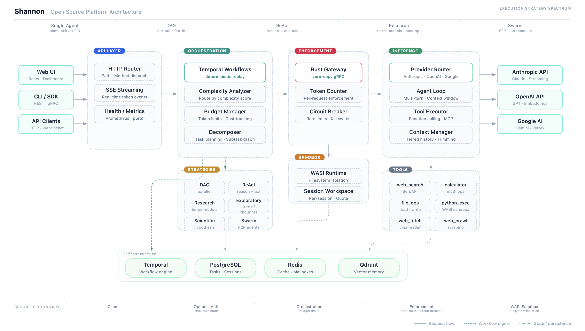

# Shannon — Production AI Agents That Actually Work

[](https://opensource.org/licenses/MIT)
[](https://docs.shannon.run)
[](https://hub.docker.com/u/waylandzhang)
[](https://github.com/Kocoro-lab/Shannon/releases)
[](https://golang.org/)
[](https://www.rust-lang.org/)
[](CONTRIBUTING.md)

Ship reliable AI agents to production. Multi-strategy orchestration, swarm collaboration, token budget control, human approval workflows, and time-travel debugging — all built in. **<a href="https://shannon.run" target="_blank">Live Demo →</a>**

<div align="center">


*View real-time agent execution and event streams*

</div>

<div align="center">



*Shannon open-source platform architecture — multi-agent orchestration with execution strategies, WASI sandboxing, and built-in observability*

</div>

## Why Shannon?

| The Problem                         | Shannon's Solution                                           |
| ----------------------------------- | ------------------------------------------------------------ |
| _Agents fail silently?_             | Temporal workflows with time-travel debugging — replay any execution step-by-step |
| _Costs spiral out of control?_      | Hard token budgets per task/agent with automatic model fallback |
| _No visibility into what happened?_ | Real-time dashboard, Prometheus metrics, OpenTelemetry tracing |
| _Security concerns?_                | WASI sandbox for code execution, OPA policies, multi-tenant isolation |
| _Vendor lock-in?_                   | Works with OpenAI, Anthropic, Google, DeepSeek, local models |

## Quick Start

### Prerequisites

- Docker and Docker Compose
- An API key for at least one LLM provider (OpenAI, Anthropic, etc.)

### Installation

**Quick Install:**

```bash
curl -fsSL https://raw.githubusercontent.com/Kocoro-lab/Shannon/v0.2.0/scripts/install.sh | bash
```

This downloads config, prompts for API keys, pulls Docker images, and starts services.

**Required API Keys** (choose one):
- OpenAI: `OPENAI_API_KEY=sk-...`
- Anthropic: `ANTHROPIC_API_KEY=sk-ant-...`
- Or any OpenAI-compatible endpoint

**Optional but recommended:**
- Web Search: `SERPAPI_API_KEY=...` (get key at [serpapi.com](https://serpapi.com))
- Web Fetch: `FIRECRAWL_API_KEY=...` (get key at [firecrawl.dev](https://firecrawl.dev))

> **Building from source?** See [Development](#development) below.
>
> **Platform-specific guides:** [Ubuntu](docs/ubuntu-quickstart.md) · [Rocky Linux](docs/rocky-linux-quickstart.md) · [Windows](docs/windows-setup-guide-en.md) · [Windows (中文)](docs/windows-setup-guide-cn.md)

### Your First Agent

Shannon provides multiple ways to interact with AI agents. Choose the option that works best for you:

#### Option 1: REST API

Use Shannon's HTTP REST API directly. For complete API documentation, see **[docs.shannon.run](https://docs.shannon.run)**.

```bash
# Submit a task
curl -X POST http://localhost:8080/api/v1/tasks \
  -H "Content-Type: application/json" \
  -d '{
    "query": "What is the capital of France?",
    "session_id": "demo-session"
  }'

# Response: {"task_id":"task-dev-123","status":"running"}

# Stream events in real-time
curl -N "http://localhost:8080/api/v1/stream/sse?workflow_id=task-dev-123"

# Get final result
curl "http://localhost:8080/api/v1/tasks/task-dev-123"
```

**Perfect for:**
- Integrating Shannon into existing applications
- Automation scripts and workflows
- Language-agnostic integration

#### Option 2: Python SDK

Install the official Shannon Python SDK:

```bash
pip install shannon-sdk
```

```python
from shannon import ShannonClient

# Create client
with ShannonClient(base_url="http://localhost:8080") as client:
    # Submit task
    handle = client.submit_task(
        "What is the capital of France?",
        session_id="demo-session"
    )

    # Wait for completion
    result = client.wait(handle.task_id)
    print(result.result)
```

CLI is also available:

```bash
shannon submit "What is the capital of France?"
```

**Perfect for:**
- Python-based applications and notebooks
- Data science workflows
- Batch processing and automation

See [Python SDK Documentation](https://pypi.org/project/shannon-sdk/) for the full API reference.

#### Option 3: Native Desktop App

Download pre-built desktop applications from [GitHub Releases](https://github.com/Kocoro-lab/Shannon/releases/latest):

- **[macOS (Universal)](https://github.com/Kocoro-lab/Shannon/releases/latest)** — Intel & Apple Silicon
- **[Windows (x64)](https://github.com/Kocoro-lab/Shannon/releases/latest)** — MSI or EXE installer
- **[Linux (x64)](https://github.com/Kocoro-lab/Shannon/releases/latest)** — AppImage or DEB package

Or build from source:

```bash
cd desktop
npm install
npm run tauri:build  # Builds for your platform
```

**Native app benefits:**
- System tray integration and native notifications
- Offline task history (Dexie.js local database)
- Better performance and lower memory usage
- Auto-updates from GitHub releases

See [Desktop App Guide](desktop/README.md) for more details.

#### Option 4: Web UI (Needs Source Download)

Run the desktop app as a local web server for development:

```bash
# In a new terminal (backend should already be running)
cd desktop
npm install
npm run dev

# Open http://localhost:3000 in your browser
```

**Perfect for:**
- Quick testing and exploration
- Development and debugging
- Real-time event streaming visualization

### Configuring Tool API Keys

Add these to your `.env` file based on which tools you need:

```bash
# Web Search (choose one provider)
WEB_SEARCH_PROVIDER=serpapi             # serpapi | google | bing | exa
SERPAPI_API_KEY=your-serpapi-key        # serpapi.com
# OR
GOOGLE_SEARCH_API_KEY=your-google-key   # Google Custom Search
GOOGLE_SEARCH_ENGINE_ID=your-engine-id

# Web Fetch/Crawl (for deep research)
WEB_FETCH_PROVIDER=firecrawl            # firecrawl | exa | python
FIRECRAWL_API_KEY=your-firecrawl-key    # firecrawl.dev (recommended for production)
```

> **Tip:** For quick setup, just add `SERPAPI_API_KEY`. Get a key at [serpapi.com](https://serpapi.com).

### Ports & Endpoints

| Service | Port | Endpoint | Purpose |
|---------|------|----------|---------|
| **Gateway** | 8080 | `http://localhost:8080` | REST API, OpenAI-compatible `/v1` |
| **Admin/Events** | 8081 | `http://localhost:8081` | SSE/WebSocket streaming, health |
| **Orchestrator** | 50052 | `localhost:50052` | gRPC (internal) |
| **Temporal UI** | 8088 | `http://localhost:8088` | Workflow debugging |
| **Grafana** | 3030 | `http://localhost:3030` | Metrics dashboard |

## Architecture

See the [architecture diagram above](#architecture) for the full platform overview including execution strategies, sandbox isolation, and tool ecosystem.

**Components:**

- **Orchestrator (Go)** — Task routing, budget enforcement, session management, OPA policies
- **Agent Core (Rust)** — WASI sandbox, policy enforcement, session workspaces, file operations
- **LLM Service (Python)** — Provider abstraction (15+ LLMs), MCP tools, skills system
- **Data Layer** — PostgreSQL (state), Redis (sessions), Qdrant (vector memory)

## Core Capabilities

### OpenAI-Compatible API
```bash
# Drop-in replacement for OpenAI API
export OPENAI_API_BASE=http://localhost:8080/v1
# Your existing OpenAI code works unchanged
```

### Real-time Event Streaming
```bash
# Monitor agent execution in real-time (SSE)
curl -N "http://localhost:8080/api/v1/stream/sse?workflow_id=task-dev-123"

# Events include:
# - WORKFLOW_STARTED, WORKFLOW_COMPLETED
# - AGENT_STARTED, AGENT_COMPLETED
# - TOOL_INVOKED, TOOL_OBSERVATION
# - LLM_PARTIAL, LLM_OUTPUT
```

### Skills System
```bash
# List available skills
curl http://localhost:8080/api/v1/skills

# Execute task with a skill (skill becomes system prompt)
curl -X POST http://localhost:8080/api/v1/tasks \
  -H "Content-Type: application/json" \
  -d '{
    "query": "Review the auth module for security issues",
    "skill": "code-review",
    "session_id": "review-123"
  }'
```
Create custom skills in `config/skills/user/`. See [Skills System](docs/skills-system.md).

### WASI Sandbox & Session Workspaces
```bash
# Agents execute code in isolated WASI sandboxes — no network, read-only FS
# Each session gets its own workspace at /tmp/shannon-sessions/{session_id}/
curl -X POST http://localhost:8080/api/v1/tasks \
  -H "Content-Type: application/json" \
  -d '{
    "query": "Run this Python script and save the output",
    "session_id": "my-workspace"
  }'
```
WASI sandbox provides secure code execution with no system call access. See [Session Workspaces](docs/session-workspaces.md).

### Research Workflows
```bash
# Multi-agent research with automatic synthesis
curl -X POST http://localhost:8080/api/v1/tasks \
  -H "Content-Type: application/json" \
  -d '{
    "query": "Compare renewable energy adoption in EU vs US",
    "context": {
      "force_research": true,
      "research_strategy": "deep"
    }
  }'
# Orchestrates multiple research agents and synthesizes findings with citations
```

### Swarm Multi-Agent Workflows
```bash
# Peer-to-peer multi-agent collaboration with message passing
curl -X POST http://localhost:8080/api/v1/tasks \
  -H "Content-Type: application/json" \
  -d '{
    "query": "Analyze this dataset from multiple perspectives",
    "context": {
      "execution_mode": "swarm"
    }
  }'
# Agents coordinate via P2P messaging without a central supervisor
```

### Human-in-the-Loop Approval
```bash
# Tasks can pause for human approval before sensitive operations
curl -X POST http://localhost:8080/api/v1/tasks \
  -H "Content-Type: application/json" \
  -d '{
    "query": "Update the production database schema",
    "context": {
      "require_approval": true
    }
  }'
# Workflow pauses and waits for explicit human approval before proceeding
```

### Session Continuity
```bash
# Multi-turn conversations with context memory
curl -X POST http://localhost:8080/api/v1/tasks \
  -H "Content-Type: application/json" \
  -d '{"query": "What is GDP?", "session_id": "econ-101"}'

# Follow-up remembers previous context (within history window)
curl -X POST http://localhost:8080/api/v1/tasks \
  -H "Content-Type: application/json" \
  -d '{"query": "How does it relate to inflation?", "session_id": "econ-101"}'
# Agent recalls recent conversation history from the same session
```

### Scheduled Tasks
```bash
# Run tasks on a schedule (cron syntax)
curl -X POST http://localhost:8080/api/v1/schedules \
  -H "Content-Type: application/json" \
  -d '{
    "name": "Daily Market Analysis",
    "cron_expression": "0 9 * * *",
    "task_query": "Analyze market trends",
    "max_budget_per_run_usd": 0.50
  }'
```

### 10+ LLM Providers
- **OpenAI**: GPT-5.1, GPT-5 mini, GPT-5 nano
- **Anthropic**: Claude Opus 4.5, Opus 4.1, Sonnet 4.5, Haiku 4.5
- **Google**: Gemini 2.5 Pro, Gemini 2.5 Flash, Gemini 3 Pro Preview
- **xAI**: Grok 4 (reasoning & non-reasoning)
- **DeepSeek**: DeepSeek V3.2, DeepSeek R1
- **Others**: Qwen, Mistral, Meta (Llama 4), Zhipu (GLM-4.6), Cohere
- **Open-Source / Local**: Ollama (Llama, Mistral, Phi, etc.), LM Studio, vLLM — any OpenAI-compatible endpoint
- Automatic failover between providers

> **Note:** OpenAI, Anthropic, xAI, and Google providers are battle-tested. Others are supported but less extensively validated.

### MCP Integration
Native support for Model Context Protocol:
- Custom tool registration
- OAuth2 server authentication
- Rate limiting and circuit breakers
- Cost tracking for MCP tool usage

## Key Features

### Time-Travel Debugging (Needs Source Download)

```bash
# Production agent failed? Replay it locally step-by-step
./scripts/replay_workflow.sh task-prod-failure-123

# Output shows every decision, tool call, and state change
```

### Token Budget Control

```bash
curl -X POST http://localhost:8080/api/v1/tasks \
  -H "Content-Type: application/json" \
  -d '{
    "query": "Generate a market analysis report",
    "config": {
      "budget": {
        "max_tokens": 5000,
        "fallback_model": "gpt-5-mini"
      }
    }
  }'
# Automatically switches to cheaper model when 80% budget consumed
```

### OPA Policy Governance

```rego
# config/opa/policies/teams.rego
package shannon.teams

allow {
    input.team == "data-science"
    input.model in ["gpt-5", "claude-sonnet-4-5-20250929"]
}

deny_tool["database_write"] {
    input.team == "support"
}
```

### Secure Code Execution

```bash
# Python runs in isolated WASI sandbox — no network, read-only FS
./scripts/submit_task.sh "Execute Python: import os; os.system('rm -rf /')"
# Result: OSError - system calls blocked by WASI sandbox
```

## Built for Enterprise

- **Multi-Tenant Isolation** — Separate memory, budgets, and policies per tenant
- **Human-in-the-Loop** — Approval middleware pauses workflows for human review before sensitive operations
- **Audit Trail** — Complete trace of every decision and data access
- **On-Premise Ready** — No cloud dependencies, runs entirely in your infrastructure

## Configuration

Shannon uses layered configuration:

1. **Environment Variables** (`.env`) — API keys, secrets
2. **YAML Files** (`config/`) — Feature flags, model pricing, policies

Key files:

- `config/models.yaml` — LLM providers, pricing, tier configuration
- `config/features.yaml` — Feature toggles, workflow settings
- `config/opa/policies/` — Access control rules

See [Configuration Guide](config/README.md) for details.

## Troubleshooting

### Health Checks

```bash
# Check all services
docker compose -f deploy/compose/docker-compose.release.yml ps

# Gateway health
curl http://localhost:8080/health

# Admin health
curl http://localhost:8081/health
```

### View Logs

```bash
# All services
docker compose -f deploy/compose/docker-compose.release.yml logs -f

# Specific service
docker compose -f deploy/compose/docker-compose.release.yml logs -f orchestrator
docker compose -f deploy/compose/docker-compose.release.yml logs -f gateway
docker compose -f deploy/compose/docker-compose.release.yml logs -f llm-service
```

### Common Issues

**Services not starting:**
- Check `.env` has required API keys (`OPENAI_API_KEY` or `ANTHROPIC_API_KEY`)
- Ensure ports 8080, 8081, 50052 are not in use
- Run `docker compose -f deploy/compose/docker-compose.release.yml down && docker compose -f deploy/compose/docker-compose.release.yml up -d` to recreate

**Task execution fails:**
- Verify LLM API key is valid: `echo $OPENAI_API_KEY`
- Check orchestrator logs for errors
- Ensure config files exist in `./config/` directory

**Out of memory:**
- Reduce `WASI_MEMORY_LIMIT_MB` (default: 512)
- Lower `HISTORY_WINDOW_MESSAGES` (default: 50)
- Check Docker memory limits

## Documentation

| Resource                                                  | Description                 |
| --------------------------------------------------------- | --------------------------- |
| [Official Docs](https://docs.shannon.run)                 | Full documentation site     |
| [Architecture](docs/multi-agent-workflow-architecture.md) | System design deep-dive     |
| [API Reference](docs/agent-core-api.md)                   | Agent Core API              |
| [Streaming APIs](docs/streaming-api.md)                   | SSE and WebSocket streaming |
| [Python Execution](docs/python-code-execution.md)         | WASI sandbox guide          |
| [Adding Tools](docs/adding-custom-tools.md)               | Custom tool development     |

## Development

### Building from Source

For contributors who want to build and run Shannon locally:

```bash
# Clone the repository
git clone https://github.com/Kocoro-lab/Shannon.git
cd Shannon

# Setup development environment
make setup                              # Creates .env, generates proto files
echo "OPENAI_API_KEY=sk-..." >> .env    # Add your API key
./scripts/setup_python_wasi.sh          # Download Python WASI interpreter (~20MB)

# Start all services (builds locally)
make dev

# Run tests
make smoke  # E2E smoke tests
make ci     # Full CI suite
```

### Using Pre-built Images (No Build)

If you cloned the repo but want to use pre-built images instead of building:

```bash
cd Shannon
cp .env.example .env
nano .env  # Add your API keys
docker compose -f deploy/compose/docker-compose.release.yml up -d
```

### Development Commands

```bash
make lint   # Run linters (Go, Rust, Python)
make fmt    # Format code
make proto  # Regenerate proto files
make logs   # View service logs
make ps     # Service status
make down   # Stop all services
```

See [CONTRIBUTING.md](CONTRIBUTING.md) for full development guidelines.

## Contributing

We welcome contributions! See [CONTRIBUTING.md](CONTRIBUTING.md) for guidelines.

- [Open an issue](https://github.com/Kocoro-lab/Shannon/issues) — Bug reports and questions
- [View roadmap](ROADMAP.md) — What's coming next

## License

MIT License — Use it anywhere, modify anything. See [LICENSE](LICENSE).

---

<p align="center">
  <b>Stop debugging AI failures. Start shipping reliable agents.</b><br><br>
  <a href="https://github.com/Kocoro-lab/Shannon">GitHub</a> ·
  <a href="https://docs.shannon.run">Docs</a> ·
  <a href="https://x.com/shannon_agents">X</a>
</p>
