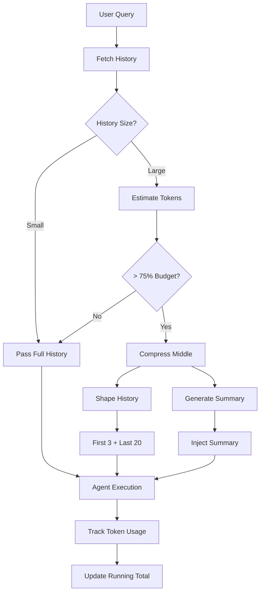

# Context Window Management System

## Overview

Shannon implements a sophisticated token-aware context window management system that enables Claude Code-like long-running debugging sessions while staying within token budgets. The system uses sliding window compression to preserve conversation continuity across hundreds of turns.

## Key Features

### 1. Configurable Context Windows
- **Default window**: 50 messages
- **Debugging preset**: 75 messages
- **Hard limits**: 5-200 messages
- **Priority order (current implementation)**:
  1. Request override (`context.history_window_size`)
  2. Use case preset (`context.use_case_preset == "debugging"` → `HISTORY_WINDOW_DEBUG_MESSAGES` or fallback 75)
  3. Environment variables (`HISTORY_WINDOW_MESSAGES`)
  4. Default value (50) if none provided

Note: Typed config fields exist in `shannon.yaml` for defaults, and are used for budget defaults today. Server-side history window currently prefers request/env for operational control.

### 2. Token Budget Management
- **Per-agent budgets**: 50,000 tokens default
- **Per-task budgets**: 200,000 tokens default (max: 200,000)
- **Progressive clamping (per-agent)**: Environment → Request context (optional). Typed config provides global defaults for BudgetManager; per-agent clamp uses env/context today.
- **Running totals**: Track cumulative usage across agents
- **Budget enforcement**: Hard stop when configured as hard limit (policy), otherwise warnings/backpressure/approval paths per budget manager configuration.

### 3. Sliding Window Compression

When conversation history exceeds 75% of token budget, the system automatically:

```
Original: [500 messages] → Too large (100k+ tokens)
                ↓
Compressed: [First 3] + [Summary] + [Last 20] = Fits budget (~15k tokens)
```

**Components**:
- **Primers (Configurable, default 3)**: Context establishment, initial requirements
- **Summary (Middle)**: Compressed semantic summary of middle messages (PII-redacted)
- **Recents (Configurable, default 20)**: Recent conversation context

The compression preserves:
- Critical setup information
- Key decisions and outcomes
- Recent conversation flow
- Error messages and debugging context

### 4. Event Streaming & Metrics

#### Real-time Events
Users receive real-time visibility into context management:
- `"Preparing context (50 msgs, ~6.2k tokens)"` - Initial context prep
- `"Memory recalled (5 items)"` - Memory system integration
- `"Context trimmed to stay within budget"` - Compression activated
- `"Previous context summary added"` - Summary injected explicitly
- `"Budget used: 14.8k/50k"` - Token usage tracking

#### Prometheus Metrics
- `shannon_compression_events_total{status=triggered|skipped|failed}` - Compression event counts
- `shannon_compression_tokens_saved` - Histogram of tokens saved per compression
- `shannon_compression_ratio` - Histogram of compression ratios achieved

## Configuration

### Environment Variables

Add to `.env` or export:

```bash
# Context Window Settings
HISTORY_WINDOW_MESSAGES=50              # Default context window size
HISTORY_WINDOW_DEBUG_MESSAGES=75        # Debugging preset window size

# Token Budget Clamping (optional)
TOKEN_BUDGET_PER_AGENT=50000           # Max tokens per agent
TOKEN_BUDGET_PER_TASK=200000           # Max tokens per task

# Compression thresholds (optional for testing/tuning)
# Trigger when estimated input ≥ ratio of budget/window
COMPRESSION_TRIGGER_RATIO=0.75         # Default 0.75
# Compress middle to this ratio of budget/window
COMPRESSION_TARGET_RATIO=0.375         # Default 0.375
```

### Configuration File

In `config/shannon.yaml`:

```yaml
session:
  # Context window presets
  context_window_default: 50
  context_window_debugging: 75

  # Token budgets (guidance for planning/enforcement)
  token_budget_per_agent: 50000
  token_budget_per_task: 200000

  # Session management
  max_history: 500              # Max messages in Redis
  ttl: 720h                     # 30-day TTL

  # Compression tuning
  primers_count: 3              # Messages to keep at start (0-1000)
  recents_count: 20             # Messages to keep at end (0-1000)
```

### Request-Level Overrides

Override per request via gRPC context:

```json
{
  "context": {
    "history_window_size": 100,           // Custom window size
    "use_case_preset": "debugging",       // Use debugging preset
    "token_budget_per_agent": 30000      // Custom agent budget
  }
}
```

## How It Works

### Flow Diagram



### Compression Algorithm

1. **Trigger**: When estimated tokens ≥ 75% of budget
2. **Extract**: Pull middle messages (between primers and recents)
3. **Compress**: Generate semantic summary via LLM
4. **Inject**: Add as `"Previous context summary: ..."`
5. **Shape**: Return first 3 + last 20 messages
6. **Execute**: Agent receives shaped history + summary

### Token Estimation

- **Base rate**: ~4 characters per token
- **Per-message overhead**: 5 tokens for formatting
- **Code adjustment**: 3 characters per token for code-heavy content
- **Safety margin**: +10% buffer

Formula: `tokens = (total_chars / 4) + (message_count * 5)`

## Usage Examples

### Standard Usage

```bash
# Regular conversation (50 messages)
./scripts/submit_task.sh "Debug my authentication flow"

# Debugging preset (75 messages)
grpcurl -plaintext -d '{
  "metadata": {"userId":"dev","sessionId":"debug-session"},
  "query": "Fix the race condition in worker pool",
  "context": {"use_case_preset": "debugging"}
}' localhost:50052 shannon.orchestrator.OrchestratorService/SubmitTask
```

### Long-Running Session

```bash
# Create a session for extended debugging
SESSION_ID="debug-$(date +%s)"

# Multiple iterations will trigger compression automatically
for i in {1..100}; do
    SESSION_ID="$SESSION_ID" ./scripts/submit_task.sh \
        "Iteration $i: Debug the memory leak in connection pool"
done

# Events you'll see:
# - "Preparing context (75 msgs, ~12.5k tokens)"
# - "Context trimmed to stay within budget"
# - "Previous context summary added"
# - "Budget used: 45.2k/200k"
```

### Multi-Agent with Budget Control

```bash
# Complex task with multiple agents
grpcurl -plaintext -d '{
  "metadata": {"userId":"dev","sessionId":"complex-task"},
  "query": "Analyze codebase, identify bottlenecks, and optimize performance",
  "context": {
    "force_p2p": true,
    "token_budget_per_agent": 30000
  }
}' localhost:50052 shannon.orchestrator.OrchestratorService/SubmitTask

# Each agent receives:
# - Shaped history (first 3 + last 20)
# - Previous context summary
# - Budget cap of 30k tokens
```

## Performance Characteristics

### Compression Effectiveness

| Scenario | Original | Compressed | Reduction |
|----------|----------|------------|-----------|
| 50 messages | ~10k tokens | No compression | 0% |
| 100 messages | ~25k tokens | ~12k tokens | 52% |
| 500 messages | ~125k tokens | ~15k tokens | 88% |
| 1000 messages | ~250k tokens | ~15k tokens | 94% |

### Latency Impact

- **Compression overhead**: 200-500ms for summary generation
- **Token estimation**: <5ms
- **History shaping**: <1ms
- **Total impact**: ~500ms for compressed paths

### Memory Usage

- **Redis storage**: Up to 500 messages per session
- **In-memory**: Only shaped history (23 messages max)
- **Summary cache**: Stored in workflow context

## Best Practices

### 1. Session Management

```bash
# Use consistent session IDs for related work
SESSION_ID="feature-xyz-debug"

# Group related debugging sessions
SESSION_ID="$SESSION_ID" ./scripts/submit_task.sh "Debug issue A"
SESSION_ID="$SESSION_ID" ./scripts/submit_task.sh "Related to A: check B"
```

### 2. Budget Optimization

```yaml
# For debugging: larger windows, higher budgets
context_window_debugging: 100
token_budget_per_agent: 75000

# For simple Q&A: smaller windows, lower budgets
context_window_default: 30
token_budget_per_agent: 25000
```

### 3. Monitoring

#### Event Monitoring
Watch for these events to understand system behavior:
- High compression frequency → Consider larger base windows
- Budget exceeded errors → Increase per-agent budgets
- Poor context quality → Adjust primer/recent counts

#### Metrics Monitoring
```bash
# Check compression effectiveness
curl http://localhost:2112/metrics | grep shannon_compression

# Import Grafana dashboard
curl -X POST http://localhost:3030/api/dashboards/db \
  -H "Content-Type: application/json" \
  -d @observability/dashboard/context-window.json
```

## Technical Details

### Implementation Files

- **Configuration**: `go/orchestrator/internal/config/shannon.go`
- **History retrieval**: `go/orchestrator/internal/server/service.go:267-322`
- **Sliding window**: `go/orchestrator/internal/workflows/helpers.go`
- **Compression logic**: `go/orchestrator/internal/workflows/simple_workflow.go`
- **Budget distribution**: `go/orchestrator/internal/workflows/supervisor_workflow.go`
- **Message helpers**: `go/orchestrator/internal/activities/stream_messages.go`

### Determinism Requirements

- Compression work runs inside activities; workflows only schedule activities
- Events emitted through activities only
- New shaping/compression paths are version-gated under `context_compress_v1`

### Privacy Considerations

- No raw message content in events (metadata only)
- Summaries filtered for PII before storage (emails, phone numbers redacted)
- Compression happens server-side only
- Token counts are estimates, not exact
- Best-effort PII masking applied to summaries before injection

## Troubleshooting

### Issue: Context seems truncated

**Symptom**: Agent responses indicate missing context

**Solutions**:
1. Increase `HISTORY_WINDOW_MESSAGES`
2. Use debugging preset: `"use_case_preset": "debugging"`
3. Check compression events in logs

### Issue: Token budget exceeded

**Symptom**: "Budget exceeded" errors

**Solutions**:
1. Set `TOKEN_BUDGET_PER_AGENT` environment variable
2. Increase `token_budget_per_task` in config
3. Enable compression (should be automatic)

### Issue: Compression not triggering

**Symptom**: No compression events in metrics or logs

**Solutions**:
1. Lower `token_budget_per_agent` in context to force compression (e.g., 1000 for testing)
2. Ensure history has > 20 messages (minimum for compression check)
3. Check that estimated tokens exceed 75% of budget threshold
4. For P2P workflows, compression triggers in SupervisorWorkflow
5. For simple tasks, compression triggers in SimpleTaskWorkflow after version gate

### Issue: Compression too aggressive

**Symptom**: Important context lost in summaries

**Solutions**:
1. Adjust `primers_count` in `config/shannon.yaml` (default: 3)
2. Increase `recents_count` in config (default: 20)
3. Override per-request via context: `"primers_count": 5, "recents_count": 30`
4. Modify compression target ratio (default: 37.5% of budget)

## Future Enhancements

### Phase 4 (Planned)

- **Use case presets**: Optimized settings for different scenarios
- **Adaptive compression**: Dynamic threshold based on content type
- **Quality metrics**: Track compression effectiveness
- **Semantic importance**: Preserve critical messages beyond primers/recents

### Under Consideration

- Hierarchical summaries for very long sessions
- Cross-session context sharing
- Compression quality scoring
- User-defined importance markers

## Related Documentation

- [Multi-Agent Workflow Architecture](./multi-agent-workflow-architecture.md)
- [Streaming API](./streaming-api.md)
- [Budget Management](./budget-management.md)
- [Memory System](./memory-system.md)
