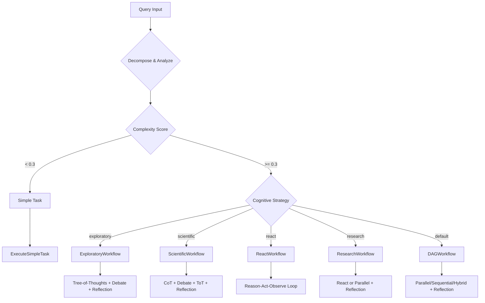

# Multi-Agent Workflow Architecture

## Overview

Shannon implements a modern, pattern-based multi-agent workflow system that enables sophisticated AI reasoning through composable patterns. The architecture follows a clean three-layer design that eliminates code duplication while providing flexibility for complex agent orchestration.

## Architecture Layers

```
┌─────────────────────────────────────────────────────────┐
│                   Orchestrator Router                    │
│  (Query decomposition, complexity analysis, routing)     │
└─────────────────┬───────────────────────────────────────┘
                  │
┌─────────────────▼───────────────────────────────────────┐
│                  Strategy Workflows                      │
│  (DAG, React, Research, Exploratory, Scientific)         │
└─────────────────┬───────────────────────────────────────┘
                  │
┌─────────────────▼───────────────────────────────────────┐
│                   Patterns Library                       │
│  (Execution: Parallel/Sequential/Hybrid)                 │
│  (Reasoning: React/Reflection/CoT/Debate/ToT)           │
└─────────────────────────────────────────────────────────┘
```

## Core Components

### 1. Orchestrator Router (`orchestrator_router.go`)
The entry point for all queries, responsible for:
- **Query Decomposition**: Analyzes query complexity and breaks down into subtasks
- **Complexity Scoring**: Determines if query is simple (< 0.3) or complex
- **Strategy Selection**: Routes to appropriate workflow based on cognitive strategy
- **Budget Management**: Enforces token limits via middleware

### 2. Strategy Workflows (`strategies/`)
High-level workflows that compose patterns for specific approaches:

#### DAGWorkflow (`dag.go`)
- Handles general task decomposition and multi-agent coordination
- Supports parallel, sequential, and hybrid (dependency-based) execution
- Applies reflection pattern for quality improvement

#### ReactWorkflow (`react.go`)
- Implements Reason-Act-Observe loops for iterative problem solving
- Best for tasks requiring tool use and environmental feedback
- Maintains observation window for context

#### ResearchWorkflow (`research.go`)
- Optimized for information gathering and synthesis
- Uses React pattern for simple research, parallel agents for complex
- Applies reflection for comprehensive results

Note on citations & verification: see `docs/deep-research.md` for current behavior and limitations (citation prompt enforcement and verification payload content).

#### ExploratoryWorkflow (`exploratory.go`)
- Systematic exploration using Tree-of-Thoughts pattern
- Falls back to Debate pattern when confidence is low
- Applies Reflection for final quality check

#### ScientificWorkflow (`scientific.go`)
- Hypothesis generation using Chain-of-Thought
- Hypothesis testing via multi-agent Debate
- Implications exploration with Tree-of-Thoughts
- Final synthesis with Reflection

### 3. Patterns Library (`patterns/`)
Reusable, composable patterns for agent behaviors:

#### Execution Patterns (`execution/`)
- **Parallel**: Concurrent agent execution with semaphore control
- **Sequential**: Step-by-step execution with result passing
- **Hybrid**: Dependency graph execution with topological sorting

#### Reasoning Patterns
- **React** (`react.go`): Reason-Act-Observe loops with tool integration
- **Reflection** (`reflection.go`): Iterative quality improvement through self-evaluation
- **Chain-of-Thought** (`chain_of_thought.go`): Step-by-step reasoning with confidence tracking
- **Debate** (`debate.go`): Multi-agent debate for exploring perspectives
- **Tree-of-Thoughts** (`tree_of_thoughts.go`): Systematic exploration with branching and pruning

## Pattern Composition

Workflows compose multiple patterns to achieve sophisticated reasoning:

```go
// Example: Scientific Workflow Composition
1. Chain-of-Thought → Generate hypotheses
2. Debate → Test competing hypotheses
3. Tree-of-Thoughts → Explore implications
4. Reflection → Final quality synthesis
```

## Workflow Selection Logic



## Configuration

### Pattern Configuration Options

Each pattern supports configuration through dedicated config structs:

```go
// Example: TreeOfThoughtsConfig
type TreeOfThoughtsConfig struct {
    MaxDepth          int     // Maximum tree depth
    BranchingFactor   int     // Number of branches per node (2-4)
    EvaluationMethod  string  // "scoring", "voting", "llm"
    PruningThreshold  float64 // Minimum score to continue branch
    ExplorationBudget int     // Max total thoughts to explore
    BacktrackEnabled  bool    // Allow backtracking to promising branches
    ModelTier         string  // Model tier for thought generation
}
```

### Workflow Configuration

Workflows are configured via `activities.WorkflowConfig`:
- `ExploratoryMaxIterations`: Maximum exploration rounds
- `ExploratoryConfidenceThreshold`: Confidence target
- `ScientificMaxHypotheses`: Number of hypotheses to generate
- `ScientificMaxIterations`: Maximum testing rounds

## Token Budget Management

All workflows respect token budgets through:
1. **Middleware**: `middleware_budget.go` enforces limits
2. **Pattern Options**: `BudgetAgentMax` field in pattern options
3. **Activity Budgets**: `ExecuteAgentWithBudgetActivity` for controlled execution

## Best Practices

### When to Use Each Workflow

| Workflow | Best For | Example Queries |
|----------|----------|-----------------|
| **Simple** | Direct questions, single-step tasks | "What is the capital of France?" |
| **DAG** | Multi-step tasks with clear subtasks | "Build a REST API with authentication" |
| **React** | Tool-using tasks, iterative problem solving | "Debug this Python code" |
| **Research** | Information gathering, comparison | "Compare React vs Vue frameworks" |
| **Exploratory** | Open-ended discovery, unknown solution space | "How can we optimize our database?" |
| **Scientific** | Hypothesis testing, systematic analysis | "Test if caching improves performance by 50%" |

### Pattern Selection Guidelines

1. **Use Reflection** when quality matters more than speed
2. **Use Chain-of-Thought** for problems requiring explicit reasoning steps
3. **Use Debate** when multiple perspectives strengthen the answer
4. **Use Tree-of-Thoughts** for complex problems with multiple solution paths
5. **Use React** when environmental feedback is needed

### Composition Strategies

1. **Start simple**: Use single patterns before composing
2. **Layer gradually**: Add patterns based on confidence thresholds
3. **Monitor tokens**: Complex compositions can be expensive
4. **Test empirically**: Measure quality improvements from each pattern

## Extension Points

### Adding New Patterns

1. Create pattern file in `patterns/`
2. Implement pattern function with standard signature:
   ```go
   func YourPattern(ctx workflow.Context, query string, context map[string]interface{},
                    sessionID string, history []string, config YourConfig, opts Options) (*YourResult, error)
   ```
3. Register in pattern registry (optional)
4. Compose in existing or new strategy workflows

### Adding New Strategies

1. Create strategy file in `strategies/`
2. Implement workflow function:
   ```go
   func YourWorkflow(ctx workflow.Context, input TaskInput) (TaskResult, error)
   ```
3. Compose patterns as needed
4. Add routing logic in `orchestrator_router.go`
5. Create wrapper in `cognitive_wrappers.go` for test compatibility

## Reflection Gating

### Overview
Shannon implements intelligent reflection gating to optimize quality while controlling costs. Reflection is automatically triggered based on task complexity.

### Configuration
- **Threshold**: Tasks with complexity > `ComplexityMediumThreshold` trigger reflection
- **Default**: 0.5 (configurable in `config/shannon.yaml`)
- **Implementation**: `shouldReflect()` function in strategy helpers

### When Reflection Occurs
- Complex queries requiring deep reasoning
- Multi-step tasks with dependencies
- Tasks with ambiguous requirements
- Configurable per workflow strategy

## Monitoring and Observability

### Metrics
- Workflow start/completion counters by type
- Pattern usage frequency
- Token consumption by pattern
- Quality scores from reflection
- Confidence levels from reasoning patterns

### Logging
- Structured logging at each layer
- Pattern selection reasoning
- Quality improvement tracking
- Token budget consumption

### Temporal UI
- Workflow visualization
- Activity timings
- Retry tracking
- Error investigation

## Human-in-the-Loop Approval

### Overview
Shannon includes a human approval workflow for high-risk operations that require oversight before execution.

### Trigger Conditions
- **Complexity Threshold**: Tasks with complexity score ≥ 0.7 (configurable via `APPROVAL_COMPLEXITY_THRESHOLD`)
- **Dangerous Tools**: Tasks using sensitive tools like `file_system` or `code_execution` (configurable via `APPROVAL_DANGEROUS_TOOLS`)

### Configuration
```bash
# .env configuration
APPROVAL_ENABLED=true                                  # Enable approval workflow
APPROVAL_COMPLEXITY_THRESHOLD=0.7                      # Complexity threshold (0.0-1.0)
APPROVAL_DANGEROUS_TOOLS=file_system,code_execution   # Comma-separated list of tools
APPROVAL_TIMEOUT_SECONDS=3600                         # Timeout in seconds (default: 1 hour)
```

### Approval Process
1. When triggered, workflow pauses and generates an approval ID
2. System waits for human decision via HTTP endpoint
3. Approval/denial can include feedback message
4. Workflow continues or terminates based on decision

### API Endpoint
```bash
# Approve or deny a pending task via Gateway (recommended)
curl -X POST "http://localhost:8080/api/v1/approvals/decision" \
  -H "Content-Type: application/json" \
  -H "X-API-Key: your-api-key" \
  -d '{
    "approval_id": "<approval-id>",
    "workflow_id": "<workflow-id>",
    "approved": true,
    "feedback": "Approved for production deployment"
  }'

# Legacy admin endpoint (deprecated, use gateway instead)
# curl -X POST "http://localhost:8081/approvals/decision" ...
```

## Performance Considerations

### Token Efficiency
- Simple tasks bypass complex patterns
- Reflection only triggers below quality threshold
- Parallel execution maximizes throughput
- Caching prevents redundant operations

### Scalability
- Semaphore-controlled parallelism (max 5 concurrent agents)
- Dependency-aware scheduling
- Circuit breakers for failing services
- Graceful degradation under load

## Migration Guide

### From Legacy Workflows
1. Identify core logic in legacy workflow
2. Map to appropriate patterns
3. Create strategy workflow composing patterns
4. Add test wrapper for compatibility
5. Update router to use new strategy
6. Delete legacy implementation

### Pattern Refactoring
1. Extract common logic into helper functions
2. Create pattern with configuration options
3. Replace inline logic with pattern calls
4. Test pattern in isolation
5. Compose in workflows

## Future Enhancements

### Planned Patterns
- **Self-Consistency**: Multiple reasoning paths with voting
- **Least-to-Most**: Problem decomposition from simple to complex
- **ReAct++**: Enhanced React with planning
- **Constitutional AI**: Value-aligned reasoning

### Planned Features
- Dynamic pattern selection based on query analysis
- Pattern performance tracking and auto-tuning
- Cross-pattern context sharing
- Pattern marketplace for community contributions

## Conclusion

Shannon's multi-agent workflow architecture provides a flexible, extensible foundation for sophisticated AI reasoning. By composing reusable patterns, developers can create powerful workflows without code duplication while maintaining clean separation of concerns.

The pattern-based approach aligns with modern frameworks like LangGraph, AutoGen, and CrewAI, making Shannon familiar to developers while providing unique capabilities through its Temporal-based orchestration and comprehensive pattern library.
