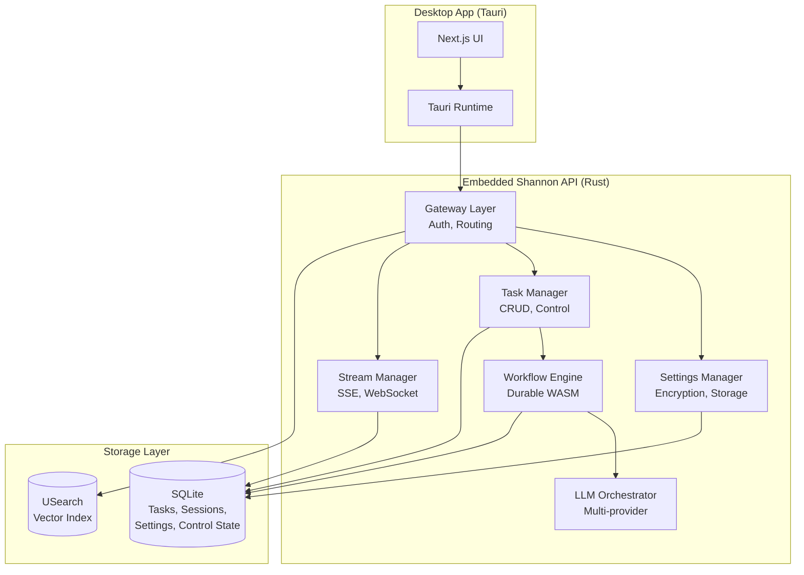
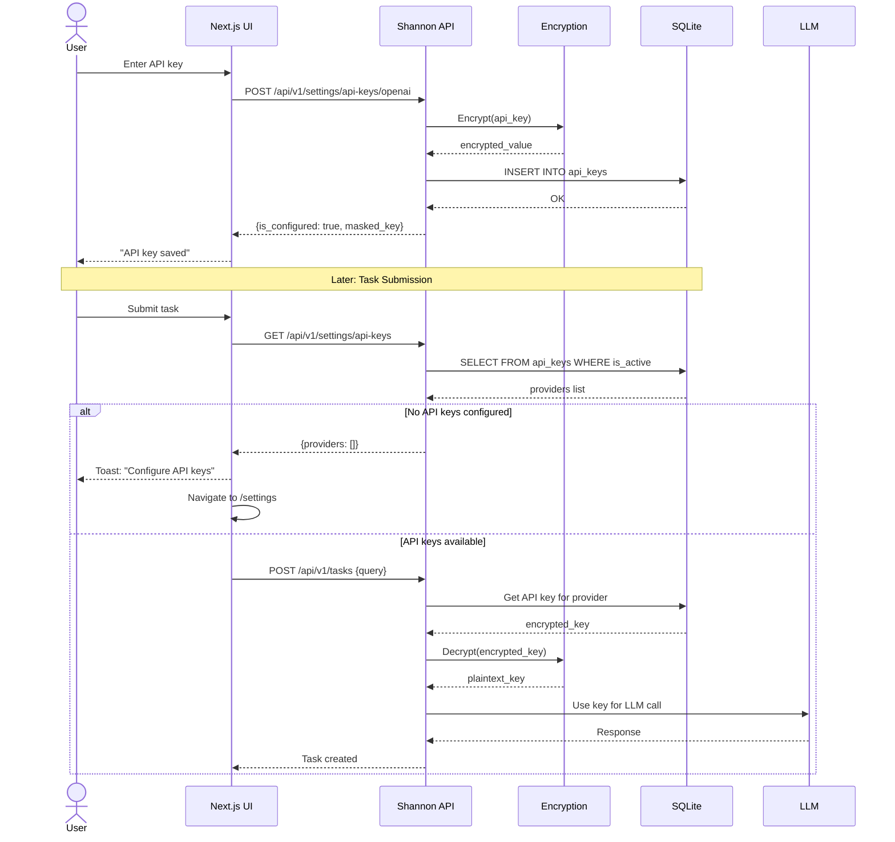
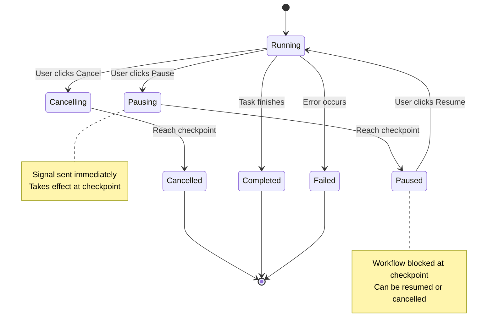
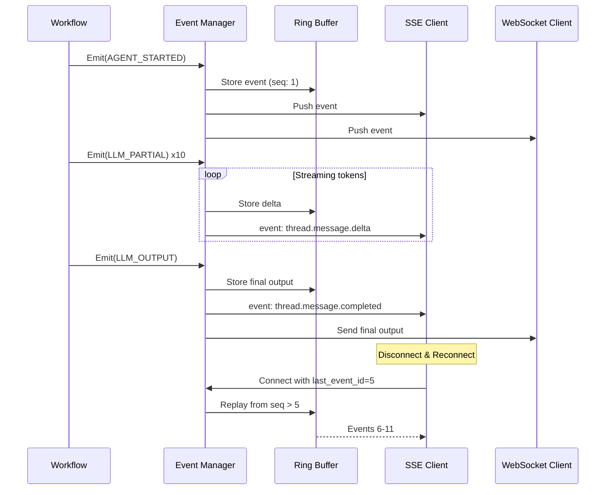

# Shannon Embedded API - Implementation Plan

**Feature**: Embedded API Feature Parity  
**Specification**: [`specs/embedded-feature-parity-spec.md`](../specs/embedded-feature-parity-spec.md)  
**Version**: 1.0  
**Created**: 2026-01-10  
**Status**: Planning Phase

---

## 1. Technical Context

### 1.1 Architecture Stack

**Current Embedded Stack**:
- **Language**: Rust (stable)
- **Web Framework**: Axum 0.8
- **Database**: SQLite + USearch (hybrid backend)
- **Workflow Engine**: Durable (WASM-based, no Temporal)
- **Desktop Framework**: Tauri 2.x
- **Frontend**: Next.js 16.1.1 + React 19

**Cloud Stack Being Replaced**:
- **Languages**: Go (Gateway/Orchestrator) + Python (LLM Service)
- **Database**: PostgreSQL + Redis + pgvector
- **Workflow Engine**: Temporal
- **Communication**: gRPC between services

### 1.2 Key Architectural Decisions

| Decision | Rationale | Trade-offs |
|----------|-----------|------------|
| **SQLite instead of PostgreSQL** | Embedded deployment, zero setup | No multi-process concurrency |
| **USearch instead of pgvector** | Rust-native, embeddable | Less mature than pgvector |
| **Durable instead of Temporal** | No external dependencies | Simpler workflow model |
| **Axum instead of distributed services** | Single binary, lower latency | Monolithic design |
| **In-memory event streaming** | No Redis dependency | Limited to single process |

### 1.3 Constraints

1. **Single Process**: All functionality in one Rust process
2. **No External Services**: No Temporal, Redis, or PostgreSQL required
3. **File-based Persistence**: SQLite files in app data directory
4. **Cross-platform**: Must work on macOS, Windows, Linux, iOS, Android
5. **Embeddable**: Must run inside Tauri WebView context

### 1.4 Technology Choices

| Component | Technology | Version | Rationale |
|-----------|------------|---------|-----------|
| Encryption | aes-gcm | 0.10 | AEAD cipher, widely audited |
| HTTP Server | Axum | 0.8 | Async, type-safe, performant |
| Database | rusqlite | Latest | SQLite bindings for Rust |
| Vector Search | usearch | 2.14 | Embeddable, fast cosine search |
| Async Runtime | tokio | Latest | Industry standard |
| Serialization | serde_json | Latest | De facto standard |
| Streaming | SSE + WebSocket | Native | Browser-compatible |

---

## 2. Data Models

### 2.1 Core Domain Models

#### Task Model
```rust
pub struct Task {
    pub id: String,              // UUID
    pub user_id: String,         // "embedded_user" for embedded mode
    pub session_id: Option<String>,
    pub workflow_id: String,
    pub query: String,
    pub mode: Option<String>,    // simple/standard/complex/supervisor
    pub status: TaskStatus,
    pub result: Option<String>,
    pub error: Option<String>,
    pub model_used: Option<String>,
    pub provider: Option<String>,
    pub usage: Option<TokenUsage>,
    pub metadata: serde_json::Value,
    pub created_at: DateTime<Utc>,
    pub started_at: Option<DateTime<Utc>>,
    pub completed_at: Option<DateTime<Utc>>,
}

pub enum TaskStatus {
    Pending,
    Running,
    Completed,
    Failed,
    Cancelled,
}

pub struct TokenUsage {
    pub total_tokens: i64,
    pub input_tokens: i64,
    pub output_tokens: i64,
    pub estimated_cost: f64,
}
```

#### Session Model
```rust
pub struct Session {
    pub session_id: String,
    pub user_id: String,
    pub title: Option<String>,
    pub task_count: i32,
    pub tokens_used: i64,
    pub token_budget: Option<i64>,
    pub created_at: DateTime<Utc>,
    pub updated_at: DateTime<Utc>,
    pub last_activity_at: Option<DateTime<Utc>>,
    pub context: serde_json::Value,
}
```

#### Control State Model
```rust
pub struct ControlState {
    pub workflow_id: String,
    pub is_paused: bool,
    pub is_cancelled: bool,
    pub paused_at: Option<DateTime<Utc>>,
    pub pause_reason: Option<String>,
    pub paused_by: Option<String>,
    pub cancel_reason: Option<String>,
    pub cancelled_by: Option<String>,
    pub updated_at: DateTime<Utc>,
}
```

#### Settings Models
```rust
pub struct UserSetting {
    pub user_id: String,
    pub setting_key: String,
    pub setting_value: String,
    pub setting_type: SettingType,
    pub encrypted: bool,
    pub created_at: DateTime<Utc>,
    pub updated_at: DateTime<Utc>,
}

pub enum SettingType {
    String,
    Number,
    Boolean,
    Json,
}

pub struct ApiKey {
    pub user_id: String,
    pub provider: String,
    pub api_key: String,  // Encrypted
    pub is_active: bool,
    pub created_at: DateTime<Utc>,
    pub updated_at: DateTime<Utc>,
    pub last_used_at: Option<DateTime<Utc>>,
}
```

### 2.2 Event Models

#### Base Event Structure
```rust
pub struct WorkflowEvent {
    pub workflow_id: String,
    pub event_type: String,
    pub agent_id: Option<String>,
    pub message: Option<String>,
    pub payload: Option<serde_json::Value>,
    pub timestamp: DateTime<Utc>,
    pub seq: i64,
    pub stream_id: Option<String>,
}
```

#### Streaming Event Types
```rust
pub enum EventType {
    // Workflow lifecycle
    WorkflowStarted,
    WorkflowCompleted,
    WorkflowFailed,
    
    // Agent lifecycle
    AgentStarted,
    AgentCompleted,
    AgentFailed,
    
    // LLM events
    LlmPrompt,
    LlmPartial,       // Maps to thread.message.delta
    LlmOutput,        // Maps to thread.message.completed
    
    // Tool events
    ToolInvoked,
    ToolObservation,
    ToolError,
    
    // Control signals
    WorkflowPausing,
    WorkflowPaused,
    WorkflowResumed,
    WorkflowCancelling,
    WorkflowCancelled,
    
    // Multi-agent
    RoleAssigned,
    Delegation,
    Progress,
    TeamRecruited,
    TeamRetired,
    TeamStatus,
    
    // Advanced
    BudgetThreshold,
    DataProcessing,
    Synthesis,
    Reflection,
    Waiting,
    ErrorRecovery,
    ErrorOccurred,
    DependencySatisfied,
    ApprovalRequested,
    ApprovalDecision,
    MessageSent,
    MessageReceived,
    WorkspaceUpdated,
    StatusUpdate,
    StreamEnd,
}
```

### 2.3 Request/Response Models

#### Task Submit Request
```rust
pub struct TaskSubmitRequest {
    pub query: String,
    pub session_id: Option<String>,
    pub mode: Option<String>,
    pub model_tier: Option<String>,
    pub model_override: Option<String>,
    pub provider_override: Option<String>,
    pub research_strategy: Option<String>,
    pub max_concurrent_agents: Option<i32>,
    pub enable_verification: Option<bool>,
    pub context: Option<TaskContext>,
}

pub struct TaskContext {
    pub role: Option<String>,
    pub system_prompt: Option<String>,
    pub prompt_params: Option<HashMap<String, String>>,
    pub model_tier: Option<String>,
    pub model_override: Option<String>,
    pub provider_override: Option<String>,
    pub template: Option<String>,
    pub template_version: Option<String>,
    pub disable_ai: Option<bool>,
    pub force_research: Option<bool>,
    pub iterative_research_enabled: Option<bool>,
    pub iterative_max_iterations: Option<i32>,
    pub enable_fact_extraction: Option<bool>,
    pub enable_citations: Option<bool>,
    pub react_max_iterations: Option<i32>,
    pub history_window_size: Option<i32>,
    pub primers_count: Option<i32>,
    pub recents_count: Option<i32>,
    pub compression_trigger_ratio: Option<f64>,
    pub compression_target_ratio: Option<f64>,
}
```

#### Task Response
```rust
pub struct TaskResponse {
    pub task_id: String,
    pub workflow_id: String,
    pub status: String,
    pub result: Option<String>,
    pub model_used: Option<String>,
    pub provider: Option<String>,
    pub usage: Option<TokenUsage>,
    pub metadata: TaskMetadata,
    pub created_at: DateTime<Utc>,
    pub completed_at: Option<DateTime<Utc>>,
}

pub struct TaskMetadata {
    pub model_breakdown: Vec<ModelUsage>,
    pub agent_usages: Option<serde_json::Value>,
}

pub struct ModelUsage {
    pub model: String,
    pub provider: String,
    pub executions: i32,
    pub tokens: i64,
    pub cost_usd: f64,
    pub percentage: f64,
}
```

---

## 3. API Contracts

### 3.1 Critical Path Endpoints (P0)

#### Get Control State
```yaml
GET /api/v1/tasks/{task_id}/control-state
Security: Embedded bypass
Response: 200 OK
{
  "is_paused": false,
  "is_cancelled": false,
  "paused_at": "2026-01-10T22:00:00Z",  # nullable
  "pause_reason": "User requested pause",  # nullable
  "paused_by": "embedded_user",  # nullable
  "cancel_reason": null,
  "cancelled_by": null
}
Error: 404 if task not found
```

#### Get Task Output
```yaml
GET /api/v1/tasks/{task_id}/output
Security: Embedded bypass
Response: 200 OK
{
  "task_id": "task-123",
  "output": "The final result text...",
  "status": "completed",
  "tokens_used": 1500,
  "cost_usd": 0.025,
  "completed_at": "2026-01-10T22:00:00Z"
}
Error: 404 if task not found, 400 if not completed
```

#### Settings - Get All
```yaml
GET /api/v1/settings
Security: Embedded bypass
Response: 200 OK
{
  "settings": [
    {
      "key": "default_model",
      "value": "gpt-4o",
      "type": "string"
    }
  ]
}
```

#### Settings - Set
```yaml
POST /api/v1/settings
Security: Embedded bypass
Request:
{
  "key": "default_model",
  "value": "gpt-4o",
  "type": "string"  # optional, inferred if not provided
}
Response: 201 Created
{
  "key": "default_model",
  "value": "gpt-4o",
  "type": "string",
  "created_at": "2026-01-10T22:00:00Z",
  "updated_at": "2026-01-10T22:00:00Z"
}
```

#### API Keys - List Providers
```yaml
GET /api/v1/settings/api-keys
Security: Embedded bypass
Response: 200 OK
{
  "providers": [
    {
      "provider": "openai",
      "is_configured": true,
      "masked_key": "sk-...xyz",
      "last_used_at": "2026-01-10T21:50:00Z"
    },
    {
      "provider": "anthropic",
      "is_configured": false
    }
  ]
}
```

#### API Keys - Set Key
```yaml
POST /api/v1/settings/api-keys/{provider}
Security: Embedded bypass
Request:
{
  "api_key": "sk-proj-abc123..."
}
Response: 201 Created
{
  "provider": "openai",
  "is_configured": true,
  "masked_key": "sk-...123",
  "created_at": "2026-01-10T22:00:00Z"
}
Error: 400 if invalid provider or key format
```

### 3.2 Core Task Management (P1)

#### List Tasks
```yaml
GET /api/v1/tasks?limit=50&offset=0&status=completed
Security: Embedded bypass
Response: 200 OK
{
  "tasks": [/* array of Task objects */],
  "total_count": 150,
  "limit": 50,
  "offset": 0
}
```

#### Get Task Progress
```yaml
GET /api/v1/tasks/{task_id}/progress
Security: Embedded bypass
Response: 200 OK
{
  "task_id": "task-123",
  "workflow_id": "wf-123",
  "status": "running",
  "progress_percent": 45,
  "current_step": "Analyzing data",
  "total_steps": 5,
  "completed_steps": 2,
  "elapsed_time_ms": 15000,
  "estimated_remaining_ms": 18000,
  "subtasks": [...],
  "tokens_used": 500,
  "cost_usd": 0.01
}
```

#### Pause Task
```yaml
POST /api/v1/tasks/{task_id}/pause
Security: Embedded bypass
Request:
{
  "reason": "User requested pause"  # optional
}
Response: 200 OK
{
  "success": true,
  "message": "Task will pause at next checkpoint",
  "task_id": "task-123"
}
```

#### Resume Task
```yaml
POST /api/v1/tasks/{task_id}/resume
Security: Embedded bypass
Request:
{
  "reason": "Continuing task"  # optional
}
Response: 200 OK
{
  "success": true,
  "message": "Task resumed",
  "task_id": "task-123"
}
```

#### Cancel Task
```yaml
POST /api/v1/tasks/{task_id}/cancel
Security: Embedded bypass
Request:
{
  "reason": "No longer needed"  # optional
}
Response: 200 OK
{
  "success": true,
  "message": "Task cancelled",
  "task_id": "task-123"
}
```

### 3.3 Session Management (P1)

#### List Sessions
```yaml
GET /api/v1/sessions?limit=20&offset=0
Security: Embedded bypass
Response: 200 OK
{
  "sessions": [/* array of Session objects */],
  "total_count": 50
}
```

#### Get Session
```yaml
GET /api/v1/sessions/{session_id}
Security: Embedded bypass
Response: 200 OK
{
  "session_id": "sess-123",
  "user_id": "embedded_user",
  "title": "Research Session",
  "task_count": 5,
  "tokens_used": 15000,
  "created_at": "2026-01-10T20:00:00Z",
  /* ...additional fields... */
}
```

#### Get Session History
```yaml
GET /api/v1/sessions/{session_id}/history
Security: Embedded bypass
Response: 200 OK
{
  "session_id": "sess-123",
  "tasks": [/* array of TaskHistory objects */],
  "total": 5
}
```

### 3.4 Streaming Endpoints (P1)

#### SSE Stream
```yaml
GET /stream/sse?workflow_id=wf-123&types=AGENT_STARTED,AGENT_COMPLETED&last_event_id=42
Security: Embedded bypass (no auth header required in embedded mode)
Response: 200 OK (text/event-stream)

Content-Type: text/event-stream
Cache-Control: no-cache
Connection: keep-alive

id: 1
event: AGENT_STARTED
data: {"workflow_id":"wf-123","type":"AGENT_STARTED","agent_id":"agent-1","message":"Starting analysis","seq":1,"timestamp":"2026-01-10T22:00:00Z"}

id: 2
event: AGENT_COMPLETED
data: {"workflow_id":"wf-123","type":"AGENT_COMPLETED","agent_id":"agent-1","message":"Analysis complete","seq":2,"timestamp":"2026-01-10T22:00:15Z"}

: ping

event: STREAM_END
data: {"workflow_id":"wf-123","type":"STREAM_END"}
```

**Features**:
- Heartbeat pings every 10s (`: ping`)
- Resume support via `last_event_id` query param or `Last-Event-ID` header
- Event filtering via `types` parameter (comma-separated)
- Auto-close on STREAM_END event

#### WebSocket Stream
```yaml
GET /stream/ws?workflow_id=wf-123&types=AGENT_STARTED&last_event_id=0
Security: Embedded bypass
Upgrade: WebSocket
Response: 101 Switching Protocols

Message Format (JSON):
{
  "workflow_id": "wf-123",
  "type": "AGENT_STARTED",
  "agent_id": "agent-1",
  "message": "Starting analysis",
  "seq": 1,
  "timestamp": "2026-01-10T22:00:00Z"
}

Ping/Pong: Server sends ping every 20s
```

---

## 4. Database Schema Extensions

### 4.1 Tasks Table (NEW)
```sql
CREATE TABLE IF NOT EXISTS tasks (
    id TEXT PRIMARY KEY,
    user_id TEXT NOT NULL DEFAULT 'embedded_user',
    session_id TEXT,
    workflow_id TEXT NOT NULL,
    query TEXT NOT NULL,
    mode TEXT,
    status TEXT NOT NULL,
    result TEXT,
    error TEXT,
    model_used TEXT,
    provider TEXT,
    usage_json TEXT,  -- JSON: {total_tokens, input_tokens, output_tokens, cost}
    metadata_json TEXT,  -- JSON: Full metadata including model_breakdown
    created_at TEXT NOT NULL,
    started_at TEXT,
    completed_at TEXT
);

CREATE INDEX idx_tasks_user_id ON tasks(user_id);
CREATE INDEX idx_tasks_session_id ON tasks(session_id);
CREATE INDEX idx_tasks_workflow_id ON tasks(workflow_id);
CREATE INDEX idx_tasks_status ON tasks(status);
CREATE INDEX idx_tasks_created_at ON tasks(created_at DESC);
```

### 4.2 Sessions Table (NEW)
```sql
CREATE TABLE IF NOT EXISTS sessions (
    session_id TEXT PRIMARY KEY,
    user_id TEXT NOT NULL DEFAULT 'embedded_user',
    title TEXT,
    task_count INTEGER NOT NULL DEFAULT 0,
    tokens_used INTEGER NOT NULL DEFAULT 0,
    token_budget INTEGER,
    context_json TEXT,  -- JSON
    created_at TEXT NOT NULL,
    updated_at TEXT NOT NULL,
    last_activity_at TEXT
);

CREATE INDEX idx_sessions_user_id ON sessions(user_id);
CREATE INDEX idx_sessions_updated_at ON sessions(updated_at DESC);
```

### 4.3 Already Implemented (✅)
- workflow_control_state
- user_settings  
- api_keys
- workflow_events
- runs
- memories

---

## 5. Implementation Phases

### Phase 1: Foundation (P0) - 10-15 hours

#### 5.1.1 Encryption Module
**File**: `rust/shannon-api/src/database/encryption.rs`

```rust
//! API key encryption using AES-256-GCM
//!
//! Provides secure encryption/decryption for storing API keys in SQLite.

use aes_gcm::{
    aead::{Aead, KeyInit, OsRng},
    Aes256Gcm, Nonce,
};
use anyhow::{Context, Result};
use base64::{Engine as _, engine::general_purpose};
use rand::RngCore;
use std::path::PathBuf;

/// Encryption key size (32 bytes for AES-256)
const KEY_SIZE: usize = 32;

/// Nonce size (12 bytes recommended for AES-GCM)
const NONCE_SIZE: usize = 12;

/// Key manager for API key encryption
pub struct KeyManager {
    cipher: Aes256Gcm,
}

impl KeyManager {
    /// Load or generate encryption key
    pub fn new(key_path: &PathBuf) -> Result<Self> {
        let key = Self::load_or_generate_key(key_path)?;
        let cipher = Aes256Gcm::new(&key.into());
        Ok(Self { cipher })
    }

    /// Encrypt a plaintext API key
    pub fn encrypt(&self, plaintext: &str) -> Result<String> {
        // Generate random nonce
        let mut nonce_bytes = [0u8; NONCE_SIZE];
        OsRng.fill_bytes(&mut nonce_bytes);
        let nonce = Nonce::from_slice(&nonce_bytes);

        // Encrypt
        let ciphertext = self
            .cipher
            .encrypt(nonce, plaintext.as_bytes())
            .context("Encryption failed")?;

        // Combine nonce + ciphertext
        let mut result = nonce_bytes.to_vec();
        result.extend_from_slice(&ciphertext);

        // Base64 encode
        Ok(general_purpose::STANDARD.encode(result))
    }

    /// Decrypt an encrypted API key
    pub fn decrypt(&self, encrypted: &str) -> Result<String> {
        // Base64 decode
        let combined = general_purpose::STANDARD
            .decode(encrypted)
            .context("Invalid base64")?;

        // Split nonce and ciphertext
        if combined.len() < NONCE_SIZE {
            anyhow::bail!("Invalid encrypted data");
        }

        let (nonce_bytes, ciphertext) = combined.split_at(NONCE_SIZE);
        let nonce = Nonce::from_slice(nonce_bytes);

        // Decrypt
        let plaintext = self
            .cipher
            .decrypt(nonce, ciphertext)
            .context("Decryption failed")?;

        String::from_utf8(plaintext).context("Invalid UTF-8")
    }

    /// Load key from file or generate new one
    fn load_or_generate_key(path: &PathBuf) -> Result<[u8; KEY_SIZE]> {
        if path.exists() {
            // Load existing key
            let encoded = std::fs::read_to_string(path)?;
            let bytes = general_purpose::STANDARD.decode(encoded.trim())?;
            if bytes.len() != KEY_SIZE {
                anyhow::bail!("Invalid key size");
            }
            let mut key = [0u8; KEY_SIZE];
            key.copy_from_slice(&bytes);
            Ok(key)
        } else {
            // Generate new key
            let mut key = [0u8; KEY_SIZE];
            OsRng.fill_bytes(&mut key);
            
            // Save to file
            if let Some(parent) = path.parent() {
                std::fs::create_dir_all(parent)?;
            }
            let encoded = general_purpose::STANDARD.encode(key);
            std::fs::write(path, encoded)?;
            
            // Set restrictive permissions (Unix only)
            #[cfg(unix)]
            {
                use std::os::unix::fs::PermissionsExt;
                let mut perms = std::fs::metadata(path)?.permissions();
                perms.set_mode(0o600);  // Read/write for owner only
                std::fs::set_permissions(path, perms)?;
            }
            
            Ok(key)
        }
    }

    /// Mask an API key for display (show first 3 + last 3 chars)
    pub fn mask_key(key: &str) -> String {
        if key.len() <= 6 {
            return "***".to_string();
        }
        format!("{}...{}", &key[..3], &key[key.len()-3..])
    }
}

#[cfg(test)]
mod tests {
    use super::*;
    use tempfile::tempdir;

    #[test]
    fn test_encrypt_decrypt() {
        let dir = tempdir().unwrap();
        let key_path = dir.path().join("test.key");
        
        let km = KeyManager::new(&key_path).unwrap();
        let plaintext = "sk-proj-test123";
        
        let encrypted = km.encrypt(plaintext).unwrap();
        let decrypted = km.decrypt(&encrypted).unwrap();
        
        assert_eq!(plaintext, decrypted);
        assert_ne!(plaintext, encrypted);
    }

    #[test]
    fn test_mask_key() {
        assert_eq!(KeyManager::mask_key("sk-proj-abc123"), "sk-...123");
        assert_eq!(KeyManager::mask_key("short"), "***");
    }
}
```

#### 5.1.2 Settings Repository
**File**: `rust/shannon-api/src/database/settings.rs`

**Traits**:
```rust
#[async_trait]
pub trait SettingsRepository: Send + Sync {
    async fn get_setting(&self, user_id: &str, key: &str) -> Result<Option<UserSetting>>;
    async fn list_settings(&self, user_id: &str) -> Result<Vec<UserSetting>>;
    async fn set_setting(&self, setting: &UserSetting) -> Result<()>;
    async fn delete_setting(&self, user_id: &str, key: &str) -> Result<bool>;
}

#[async_trait]
pub trait ApiKeyRepository: Send + Sync {
    async fn get_api_key(&self, user_id: &str, provider: &str) -> Result<Option<String>>;
    async fn list_providers(&self, user_id: &str) -> Result<Vec<ApiKeyInfo>>;
    async fn set_api_key(&self, user_id: &str, provider: &str, encrypted_key: &str) -> Result<()>;
    async fn delete_api_key(&self, user_id: &str, provider: &str) -> Result<bool>;
    async fn mark_key_used(&self, user_id: &str, provider: &str) -> Result<()>;
}
```

#### 5.1.3 Control State Repository Extension
**File**: `rust/shannon-api/src/database/hybrid.rs` (extend existing)

**New methods**:
```rust
impl HybridBackend {
    pub async fn get_control_state(&self, workflow_id: &str) -> Result<Option<ControlState>>;
    pub async fn set_control_state(&self, state: &ControlState) -> Result<()>;
    pub async fn update_pause(&self, workflow_id: &str, paused: bool, reason: Option<String>, by: Option<String>) -> Result<()>;
    pub async fn update_cancel(&self, workflow_id: &str, cancelled: bool, reason: Option<String>, by: Option<String>) -> Result<()>;
}
```

#### 5.1.4 Task Repository Extension
**File**: `rust/shannon-api/src/database/repository.rs`

**New trait methods**:
```rust
#[async_trait]
pub trait TaskRepository: Send + Sync {
    async fn create_task(&self, task: &Task) -> Result<String>;
    async fn get_task(&self, id: &str) -> Result<Option<Task>>;
    async fn update_task(&self, task: &Task) -> Result<()>;
    async fn list_tasks(&self, user_id: &str, limit: usize, offset: usize, status_filter: Option<TaskStatus>) -> Result<Vec<Task>>;
    async fn delete_task(&self, id: &str) -> Result<bool>;
}
```

#### 5.1.5 Settings API Routes
**File**: `rust/shannon-api/src/gateway/settings.rs` (NEW)

**Route handlers**:
- `get_all_settings()` - GET /api/v1/settings
- `get_setting()` - GET /api/v1/settings/{key}
- `set_setting()` - POST /api/v1/settings
- `delete_setting()` - DELETE /api/v1/settings/{key}
- `list_api_keys()` - GET /api/v1/settings/api-keys
- `get_api_key_status()` - GET /api/v1/settings/api-keys/{provider}
- `set_api_key()` - POST /api/v1/settings/api-keys/{provider}
- `delete_api_key()` - DELETE /api/v1/settings/api-keys/{provider}

#### 5.1.6 Control State & Task Routes
**File**: `rust/shannon-api/src/gateway/tasks.rs` (extend existing)

**New route handlers**:
- `get_task_control_state()` - GET /api/v1/tasks/{id}/control-state
- `get_task_output()` - GET /api/v1/tasks/{id}/output
- `get_task_progress()` - GET /api/v1/tasks/{id}/progress
- `pause_task()` - POST /api/v1/tasks/{id}/pause
- `resume_task()` - POST /api/v1/tasks/{id}/resume
- `cancel_task()` - POST /api/v1/tasks/{id}/cancel

#### 5.1.7 Frontend Integration
**Files**: 
- `desktop/lib/shannon/settings.ts` (NEW)
- `desktop/app/(app)/run-detail/page.tsx` (MODIFY)
- `desktop/app/(app)/settings/page.tsx` (MODIFY)

**Features**:
- API key validation before task submission
- Toast notifications via `sonner`
- Settings page with API key management UI
- Automatic navigation to settings when keys missing

---

### Phase 2: Core Functionality (P1) - 20-30 hours

#### 5.2.1 Session Management Implementation
- Session repository methods
- Session API endpoints
- Session history tracking
- Task-to-session linking

#### 5.2.2 Task Management Completion
- Task repository with full CRUD
- Task list endpoint with filtering
- Task progress tracking
- Task output retrieval

#### 5.2.3 Streaming Infrastructure
- In-memory event buffer (ring buffer, 256 events)
- SSE endpoint with event filtering
- WebSocket endpoint
- Event persistence to database
- Heartbeat mechanism
- Resume support with last_event_id

#### 5.2.4 Core Event Types
Implement event emission for:
- WORKFLOW_STARTED, WORKFLOW_COMPLETED, WORKFLOW_FAILED
- AGENT_STARTED, AGENT_COMPLETED, AGENT_FAILED  
- ERROR_OCCURRED

---

### Phase 3: Enhanced Functionality (P2) - 30-40 hours

#### 5.3.1 Context Parameters
Implement full context object support:
- role, system_prompt, prompt_params
- model_tier, model_override, provider_override
- research_strategy parameters
- context window management parameters

#### 5.3.2 LLM Event Streaming
- LLM_PROMPT - Prompt sent to LLM
- LLM_PARTIAL - Streaming token deltas (map to thread.message.delta)
- LLM_OUTPUT - Final response + usage (map to thread.message.completed)

#### 5.3.3 Tool Event Streaming
- TOOL_INVOKED - Tool execution started
- TOOL_OBSERVATION - Tool result received
- TOOL_ERROR - Tool execution failed

#### 5.3.4 Control Signal Events
- WORKFLOW_PAUSING, WORKFLOW_PAUSED, WORKFLOW_RESUMED
- WORKFLOW_CANCELLING, WORKFLOW_CANCELLED

#### 5.3.5 Response Enhancements
- model_used, provider fields
- usage object with all token counts
- metadata.model_breakdown array

---

### Phase 4: Advanced Features (P3) - 40-60 hours

#### 5.4.1 Multi-Agent Events
- ROLE_ASSIGNED, DELEGATION, PROGRESS
- TEAM_RECRUITED, TEAM_RETIRED, TEAM_STATUS

#### 5.4.2 Advanced Events
- BUDGET_THRESHOLD, SYNTHESIS, REFLECTION
- WAITING, ERROR_RECOVERY, DEPENDENCY_SATISFIED
- APPROVAL_REQUESTED, APPROVAL_DECISION
- MESSAGE_SENT, MESSAGE_RECEIVED, WORKSPACE_UPDATED

#### 5.4.3 Schedule Management
- Schedule CRUD endpoints
- Cron expression parsing
- Schedule execution system
- Schedule runs tracking

#### 5.4.4 Tool Integration
- Tool registration system
- Tool allowlist/blocklist
- Tool caching
- Tool retry logic
- OpenAPI tool generation
- MCP tool integration

---

## 6. Testing Strategy

### 6.1 Integration Test Structure

```
tests/
├── integration/
│   ├── api/
│   │   ├── test_tasks.rs
│   │   ├── test_sessions.rs
│   │   ├── test_settings.rs
│   │   ├── test_streaming.rs
│   │   └── test_control.rs
│   ├── database/
│   │   ├── test_hybrid_backend.rs
│   │   ├── test_encryption.rs
│   │   └── test_migrations.rs
│   ├── workflows/
│   │   ├── test_simple_workflow.rs
│   │   ├── test_pause_resume.rs
│   │   └── test_cancellation.rs
│   └── e2e/
│       ├── test_task_lifecycle.rs
│       ├── test_streaming_flow.rs
│       └── test_api_key_flow.rs
```

### 6.2 Test Scenarios

#### Critical Path Tests (P0)
1. **API Key Management**
   - Store encrypted API key
   - Retrieve and decrypt API key
   - List providers with masked keys
   - Delete API key
   - Validate key format

2. **Control State**
   - Get control state for workflow
   - Pause workflow and verify state
   - Resume workflow and verify state
   - Cancel workflow and verify state

3. **Task Output**
   - Submit task and wait for completion
   - Retrieve final output
   - Verify all fields present

4. **Settings Management**
   - Store setting
   - Retrieve setting
   - Update setting
   - Delete setting

#### Core Functionality Tests (P1)
1. **Task Management**
   - List tasks with pagination
   - Filter tasks by status
   - Get task progress during execution

2. **Session Management**
   - Create session
   - Add tasks to session
   - Get session history
   - List all sessions

3. **Streaming**
   - Connect to SSE stream
   - Receive events in order
   - Reconnect with last_event_id
   - Filter events by type

### 6.3 Test Utilities

```rust
// Shared test utilities
pub struct TestContext {
    pub api_base_url: String,
    pub db_backend: HybridBackend,
    pub temp_dir: TempDir,
}

impl TestContext {
    pub async fn new() -> Self {
        // Setup test database
        // Start test server
        // Return context
    }
    
    pub async fn submit_task(&self, query: &str) -> String {
        // Helper to submit task and return task_id
    }
    
    pub async fn wait_for_completion(&self, task_id: &str, timeout_secs: u64) -> TaskResponse {
        // Poll until completed or timeout
    }
}
```

### 6.4 Coverage Goals

| Phase | Integration Tests | API Coverage | Event Coverage |
|-------|-------------------|--------------|----------------|
| P0 | 15+ tests | Critical endpoints | N/A |
| P1 | 30+ tests | Core endpoints | Core events |
| P2 | 50+ tests | Enhanced endpoints | LLM/Tool events |
| P3 | 80+ tests | All endpoints | All events |

**Minimum Acceptance**: 100% of implemented features have integration tests.

---

## 7. Implementation Order

### Week 1: Foundation (P0)
**Days 1-2**: Backend Infrastructure
- ✅ Database migrations (DONE)
- ✅ aes-gcm dependency (DONE)
- Encryption module
- Settings repository
- API key repository

**Days 3-4**: API Endpoints
- Settings API routes
- Control-state endpoint
- Task output endpoint

**Day 5**: Frontend Integration & Testing
- API key validation
- Toast notifications
- Settings UI
- Integration tests

### Week 2: Core Features (P1)
**Days 1-2**: Task & Session Management
- Task repository with full CRUD
- Session repository
- Task/session endpoints

**Days 3-4**: Streaming Infrastructure
- In-memory event buffer
- SSE endpoint
- WebSocket endpoint
- Core event emission

**Day 5**: Testing
- Integration tests for all P1 features

### Week 3: Enhanced Features (P2)
**Days 1-2**: Context Parameters
- Context object parsing
- Model tier support
- Provider selection
- Research strategy presets

**Days 3-4**: Event Streaming
- LLM events (PROMPT, PARTIAL, OUTPUT)
- Tool events (INVOKED, OBSERVATION, ERROR)
- Control signal events

**Day 5**: Response Enhancements & Testing
- Usage metadata
- Model breakdown
- Integration tests

### Week 4: Advanced Features (P3)
**Days 1-3**: Multi-Agent & Advanced Events
- Multi-agent event types
- Advanced event emission
- Event persistence strategy

**Days 4-5**: Polish & Documentation
- Schedule management (if time permits)
- Documentation updates
- Final integration testing

---

## 8. Mermaid Diagrams

### 8.1 Component Architecture



### 8.2 API Key Management Flow



### 8.3 Control State Flow



### 8.4 Streaming Event Flow



---

## 9. Configuration Extensions

### 9.1 New Environment Variables

```bash
# Encryption
SHANNON_ENCRYPTION_KEY_PATH=~/.config/shannon/encryption.key

# API Keys (optional - stored in database, these are fallback)
OPENAI_API_KEY=sk-...
ANTHROPIC_API_KEY=sk-ant-...
GOOGLE_API_KEY=...
GROQ_API_KEY=...
XAI_API_KEY=...

# Settings defaults
DEFAULT_MODEL_TIER=medium
DEFAULT_TEMPERATURE=0.7
DEFAULT_MAX_TOKENS=4096

# Streaming
STREAMING_BUFFER_SIZE=256
STREAMING_HEARTBEAT_INTERVAL_SECS=10
```

### 9.2 App Config Extensions

```rust
pub struct AppConfig {
    // Existing fields...
    
    pub security: SecurityConfig,
    pub streaming: StreamingConfig,
    pub defaults: DefaultsConfig,
}

pub struct SecurityConfig {
    pub encryption_key_path: PathBuf,
    pub api_key_mask_length: usize,  // Default: 3
}

pub struct StreamingConfig {
    pub buffer_size: usize,  // Default: 256
    pub heartbeat_interval_secs: u64,  // Default: 10
    pub max_reconnect_attempts: u32,  // Default: 3
}

pub struct DefaultsConfig {
    pub model_tier: String,  // Default: "medium"
    pub temperature: f64,  // Default: 0.7
    pub max_tokens: i32,  // Default: 4096
}
```

---

## 10. Error Handling Strategy

### 10.1 Error Types

```rust
#[derive(Error, Debug)]
pub enum ApiError {
    #[error("Task not found: {task_id}")]
    TaskNotFound { task_id: String },
    
    #[error("Session not found: {session_id}")]
    SessionNotFound { session_id: String },
    
    #[error("Invalid API key format for provider: {provider}")]
    InvalidApiKeyFormat { provider: String },
    
    #[error("No API keys configured")]
    NoApiKeysConfigured,
    
    #[error("Encryption error: {0}")]
    EncryptionError(String),
    
    #[error("Database error: {0}")]
    DatabaseError(#[from] rusqlite::Error),
    
    #[error("Invalid task status transition: {from} -> {to}")]
    InvalidStatusTransition { from: String, to: String },
    
    #[error("Workflow not running, cannot {action}")]
    WorkflowNotRunning { action: String },
}

impl IntoResponse for ApiError {
    fn into_response(self) -> Response {
        let (status, error_code, message) = match self {
            Self::TaskNotFound { .. } => (StatusCode::NOT_FOUND, "task_not_found", self.to_string()),
            Self::SessionNotFound { .. } => (StatusCode::NOT_FOUND, "session_not_found", self.to_string()),
            Self::InvalidApiKeyFormat { .. } => (StatusCode::BAD_REQUEST, "invalid_api_key", self.to_string()),
            Self::NoApiKeysConfigured => (StatusCode::BAD_REQUEST, "no_api_keys", self.to_string()),
            Self::EncryptionError(_) => (StatusCode::INTERNAL_SERVER_ERROR, "encryption_error", "Encryption operation failed"),
            Self::DatabaseError(_) => (StatusCode::INTERNAL_SERVER_ERROR, "database_error", "Database operation failed"),
            Self::InvalidStatusTransition { .. } => (StatusCode::CONFLICT, "invalid_transition", self.to_string()),
            Self::WorkflowNotRunning { .. } => (StatusCode::CONFLICT, "workflow_not_running", self.to_string()),
        };
        
        let body = Json(json!({
            "error": error_code,
            "message": message
        }));
        
        (status, body).into_response()
    }
}
```

---

## 11. Performance Considerations

### 11.1 Database Optimization

**Strategies**:
- Use WAL mode for SQLite (already enabled)
- Connection pooling not needed (single process)
- Prepared statement caching
- Batch inserts for events
- Indexes on frequently queried columns

**Expected Performance**:
- Task creation: <10ms
- Task retrieval: <5ms
- Event append: <2ms
- Vector search: <50ms (1000 vectors)

### 11.2 Memory Management

**Constraints**:
- Event buffer: 256 events * ~1KB = 256KB per workflow
- Max concurrent workflows: 10 = 2.5MB event buffer total
- SQLite cache: ~10MB
- USearch index: Depends on memory count (~1MB per 1000 vectors)
- Total target: <50MB for embedded API

**Strategies**:
- LRU eviction for event buffers
- Lazy loading of embeddings
- Stream closing on inactivity
- Periodic garbage collection

### 11.3 Streaming Performance

**Targets**:
- Event emission latency: <10ms
- SSE push latency: <50ms
- Max concurrent streams per workflow: 5
- Heartbeat overhead: <1KB/sec per connection

---

## 12. Security Considerations

### 12.1 Encryption

**Algorithm**: AES-256-GCM (AEAD)
- **Key Size**: 256 bits (32 bytes)
- **Nonce Size**: 96 bits (12 bytes, random per encryption)
- **Key Storage**: File with 0600 permissions (Unix)
- **Key Generation**: Cryptographically secure RNG

**Threat Model**:
- ✅ Protects against: Database file theft
- ✅ Protects against: Memory dumps (keys encrypted at rest)
- ❌ Does NOT protect against: Process memory access
- ❌ Does NOT protect against: Key file theft (OS-level protection needed)

### 12.2 Input Validation

**Required Validations**:
- API key format (provider-specific regex)
- Setting key format (alphanumeric + underscore + hyphen)
- Setting value max length (10KB)
- Query max length (100KB)
- Session ID format (UUID or alphanumeric)
- Workflow ID format (UUID)

### 12.3 Audit Trail

**Events to Log**:
- API key created/updated/deleted
- Task submission
- Control signal sent (pause/resume/cancel)
- Settings changed

**Log Format**: Structured JSON with timestamp, user_id, action, resource_id

---

## 13. Migration Path

### 13.1 From Cloud to Embedded

**Data Migration**:
1. Export tasks from PostgreSQL
2. Convert to SQLite schema
3. Import into embedded database

**API Compatibility**:
- All endpoints maintain same request/response format
- Only deployment mode changes (cloud → embedded)
- Existing clients work without changes

**Limitations**:
- No multi-tenancy (single user: "embedded_user")
- No horizontal scaling
- No distributed tracing
- Limited to single device

### 13.2 Feature Availability Matrix

| Feature | Cloud | Embedded | Notes |
|---------|-------|----------|-------|
| Task submission | ✅ | ✅ | |
| Streaming | ✅ | ✅ | In-memory buffer instead of Redis |
| Sessions | ✅ | ✅ | |
| Control signals | ✅ | ✅ | Via Durable checkpoints |
| Schedules | ✅ | ⚠️ P3 | Lower priority for embedded |
| Multi-tenancy | ✅ | ❌ | Single user mode |
| Horizontal scaling | ✅ | ❌ | Single process |
| gRPC | ✅ | ❌ | HTTP only |

---

## 14. Risks & Mitigation

| Risk | Impact | Probability | Mitigation |
|------|--------|-------------|------------|
| **Scope too large** | High | High | Phase-based delivery, P0/P1/P2/P3 prioritization |
| **Durable workflow limitations** | High | Medium | Start with simple workflows, expand gradually |
| **Performance issues** | Medium | Medium