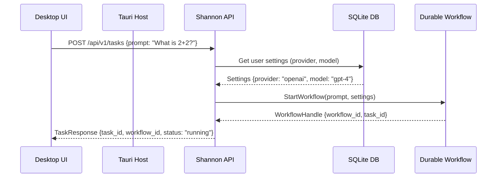
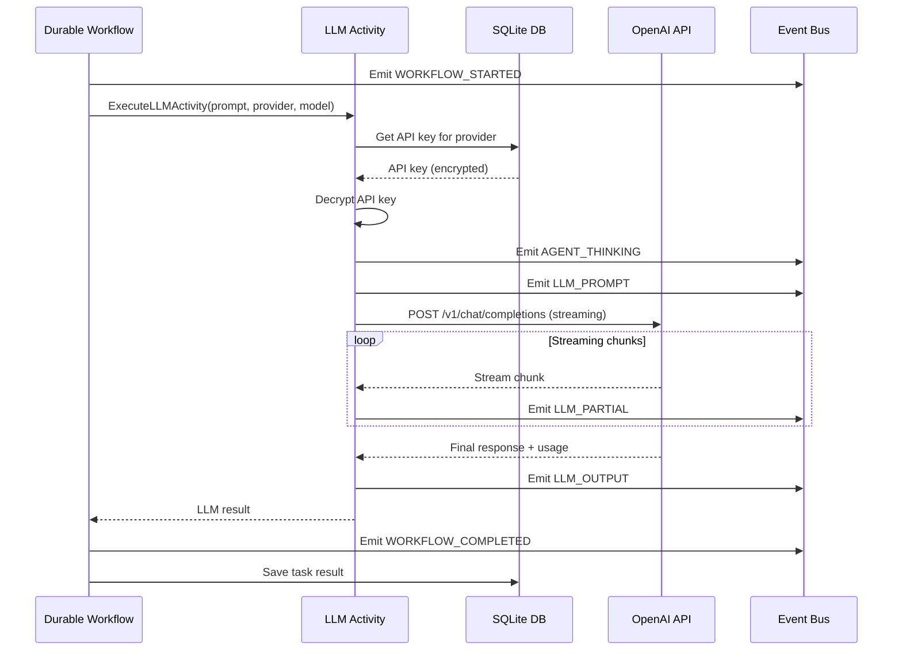
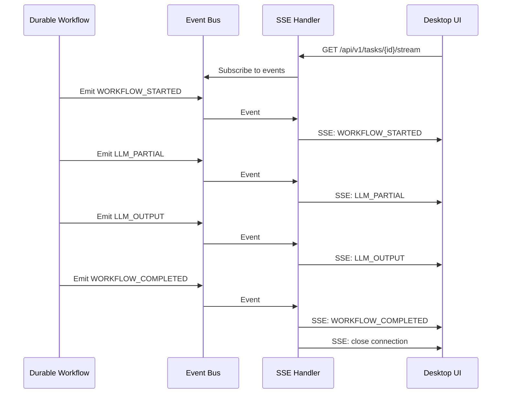

# Embedded Prompt Processing Pipeline Integration

**Status**: Planning  
**Priority**: P0 - Mission Critical  
**Created**: 2026-01-11  
**Owner**: Shannon Team

---

## Executive Summary

This specification defines the complete integration path to achieve 100% end-to-end functionality for embedded prompt processing in the Shannon desktop application. While infrastructure is 100% complete (APIs, encryption, settings, database), integration is 0% complete (workflow execution pipeline not connected).

**Goal**: User submits "What is 2+2?" and receives "4" with full visibility into every processing step.

**Current State**:
- ✅ App connection to embedded server (port 1906-1915)
- ✅ UI validation for API keys/provider/model
- ✅ Settings persistence (encrypted SQLite)
- ❌ Prompt submission → Workflow execution
- ❌ Workflow processing per docs specifications
- ❌ Debug logging visibility
- ❌ Streaming response to UI

---

## Table of Contents

1. [Architecture Overview](#architecture-overview)
2. [Integration Gaps Analysis](#integration-gaps-analysis)
3. [Data Flow Design](#data-flow-design)
4. [Implementation Phases](#implementation-phases)
5. [Quality Requirements](#quality-requirements)
6. [Success Criteria](#success-criteria)
7. [Testing Strategy](#testing-strategy)
8. [Risk Analysis](#risk-analysis)

---

## Architecture Overview

### Current Infrastructure

```
┌─────────────────────────────────────────────────────────────┐
│                      Desktop UI (Next.js)                    │
│  • Chat Input Component                                      │
│  • Debug Console (26+ event types)                          │
│  • Settings Management                                       │
└─────────────────────┬───────────────────────────────────────┘
                      │ IPC + HTTP
┌─────────────────────▼───────────────────────────────────────┐
│              Tauri Host (embedded_api.rs)                    │
│  • Port Discovery (1906-1915)                               │
│  • Server State Management                                   │
│  • IPC Event Emission                                        │
└─────────────────────┬───────────────────────────────────────┘
                      │ In-Process
┌─────────────────────▼───────────────────────────────────────┐
│              Shannon API (Rust) - Port 1906-1915            │
│  ✅ 32 API Endpoints                                         │
│  ✅ JWT Authentication                                       │
│  ✅ Settings Management                                      │
│  ✅ SSE/WebSocket Streaming                                  │
│  ❌ Task Submission (not connected)                          │
│  ❌ Workflow Integration (not connected)                     │
└─────────────────────┬───────────────────────────────────────┘
                      │ ???
┌─────────────────────▼───────────────────────────────────────┐
│          Durable-Shannon Workflow Engine (Rust)              │
│  ❌ Workflow Execution (not instantiated)                    │
│  ❌ LLM Activities (not wired)                               │
│  ❌ Event Emission (not connected)                           │
└─────────────────────┬───────────────────────────────────────┘
                      │ ???
┌─────────────────────▼───────────────────────────────────────┐
│          Provider APIs (OpenAI, Anthropic, etc.)             │
│  ❌ API Key Retrieval (not connected)                        │
│  ❌ Request Routing (not implemented)                        │
└──────────────────────────────────────────────────────────────┘
```

### Target Architecture

```
┌─────────────────────────────────────────────────────────────┐
│                      Desktop UI (Next.js)                    │
│  • Chat Input Component                                      │
│  • Debug Console (streaming events)                          │
│  • Settings Management                                       │
└─────────────────────┬───────────────────────────────────────┘
                      │ IPC + HTTP
┌─────────────────────▼───────────────────────────────────────┐
│              Tauri Host (embedded_api.rs)                    │
│  • Port Discovery (1906-1915)                               │
│  • Server State Management                                   │
│  • IPC Event Emission                                        │
└─────────────────────┬───────────────────────────────────────┘
                      │ In-Process
┌─────────────────────▼───────────────────────────────────────┐
│              Shannon API (Rust) - Port 1906-1915            │
│  POST /api/v1/tasks                                         │
│  └─> Create WorkflowRequest                                 │
│       └─> Start Durable Workflow                            │
│  GET /api/v1/tasks/{id}/stream                              │
│  └─> Subscribe to Event Stream                              │
└─────────────────────┬───────────────────────────────────────┘
                      │ In-Memory Channel
┌─────────────────────▼───────────────────────────────────────┐
│          Durable-Shannon Workflow Engine (Rust)              │
│  • Workflow Execution (deterministic)                        │
│  • LLM Activities:                                           │
│    - Retrieve API keys from settings                         │
│    - Route to provider (OpenAI/Anthropic/etc)               │
│    - Stream responses                                        │
│  • Event Emission:                                           │
│    - WORKFLOW_STARTED                                        │
│    - AGENT_THINKING                                          │
│    - LLM_PROMPT                                              │
│    - LLM_PARTIAL (streaming)                                 │
│    - LLM_OUTPUT                                              │
│    - WORKFLOW_COMPLETED                                      │
└─────────────────────┬───────────────────────────────────────┘
                      │ HTTPS
┌─────────────────────▼───────────────────────────────────────┐
│          Provider APIs (OpenAI, Anthropic, etc.)             │
│  • Authenticated with user's API keys                        │
│  • Streaming responses                                       │
└──────────────────────────────────────────────────────────────┘
```

---

## Integration Gaps Analysis

### Gap 1: Task Submission → Workflow Creation

**Current**: [`POST /api/v1/tasks`](rust/shannon-api/src/gateway/tasks.rs) exists but returns mock data.

**Required**:
1. Parse incoming task request
2. Retrieve user settings (model, provider)
3. Create workflow execution context
4. Start durable workflow instance
5. Return workflow ID + task ID

**Code Location**: `rust/shannon-api/src/gateway/tasks.rs:submit_task()`

**Dependencies**:
- `durable-shannon` workflow engine instantiation
- Settings retrieval from database
- Workflow ID generation

---

### Gap 2: API Key Retrieval in Workflow

**Current**: API keys stored encrypted in SQLite, accessible via [`rust/shannon-api/src/database/settings.rs`](rust/shannon-api/src/database/settings.rs).

**Required**:
1. Workflow activity to retrieve API key
2. Decrypt key for provider
3. Pass to LLM client
4. Handle missing/invalid keys gracefully

**Code Location**: `rust/durable-shannon/src/activities/llm.rs` (needs implementation)

**Dependencies**:
- Settings database access from workflow context
- Encryption/decryption utilities

---

### Gap 3: LLM Provider Integration

**Current**: Provider configurations exist in [`rust/shannon-api/src/config/mod.rs`](rust/shannon-api/src/config/mod.rs).

**Required**:
1. HTTP client for each provider (OpenAI, Anthropic, Google, Groq, xAI)
2. Request formatting per provider spec
3. Streaming response handling
4. Error handling and retries
5. Token usage tracking

**Code Location**: `rust/durable-shannon/src/activities/llm.rs` (needs implementation)

**Dependencies**:
- `reqwest` HTTP client
- Provider-specific request/response formats
- Streaming infrastructure

---

### Gap 4: Event Emission Pipeline

**Current**: Event types defined in [`docs/event-types.md`](docs/event-types.md), streaming endpoints exist in [`rust/shannon-api/src/gateway/streaming.rs`](rust/shannon-api/src/gateway/streaming.rs).

**Required**:
1. Event emitter in workflow context
2. In-memory event bus (tokio::sync::broadcast)
3. Event persistence to SQLite
4. SSE/WebSocket streaming to clients
5. Event filtering by type

**Code Location**: 
- `rust/durable-shannon/src/worker/mod.rs` (event emission)
- `rust/shannon-api/src/gateway/streaming.rs` (streaming handlers)

**Dependencies**:
- Event bus infrastructure
- Database event storage
- SSE/WebSocket handlers

---

### Gap 5: Debug Logging Infrastructure

**Current**: IPC logging setup exists in [`desktop/src-tauri/src/ipc_logger.rs`](desktop/src-tauri/src/ipc_logger.rs).

**Required**:
1. Workflow logs captured at all stages
2. Logs forwarded to IPC event system
3. Debug console displays logs in real-time
4. Log filtering and search

**Code Location**:
- `rust/durable-shannon/src/worker/mod.rs` (log capture)
- `desktop/components/debug-console.tsx` (log display)

**Dependencies**:
- Tracing integration
- IPC event emission
- UI log rendering

---

### Gap 6: Streaming Response Integration

**Current**: SSE endpoint exists at [`GET /api/v1/tasks/{id}/stream`](rust/shannon-api/src/gateway/streaming.rs).

**Required**:
1. LLM streaming chunks → events
2. Events → SSE stream
3. UI consumes SSE stream
4. Progressive UI updates

**Code Location**:
- `rust/durable-shannon/src/activities/llm.rs` (chunk emission)
- `desktop/components/chat-input.tsx` (SSE consumption)

**Dependencies**:
- Event bus
- SSE client in UI
- State management

---

## Data Flow Design

### 1. Task Submission Flow



### 2. Workflow Execution Flow



### 3. Event Streaming Flow



---

## Implementation Phases

### Phase 1: Task → Workflow Integration (Week 1)

**Goal**: Connect task submission to workflow engine.

**Tasks**:

1. **Instantiate Durable Workflow Engine** (`rust/shannon-api/src/main.rs`)
   - Add `durable-shannon` to Shannon API dependencies
   - Create workflow engine instance on startup
   - Store in `AppState` for shared access
   
   ```rust
   // rust/shannon-api/src/main.rs
   use durable_shannon::worker::WorkflowWorker;
   
   pub struct AppState {
       pub config: AppConfig,
       pub database: Option<Database>,
       pub workflow_worker: Arc<WorkflowWorker>, // NEW
   }
   ```

2. **Implement Task Submission Handler** (`rust/shannon-api/src/gateway/tasks.rs`)
   - Remove mock implementation
   - Parse task request
   - Retrieve user settings (provider, model, API key presence)
   - Generate workflow ID (UUID)
   - Start workflow instance
   - Return workflow ID + task ID
   
   ```rust
   // rust/shannon-api/src/gateway/tasks.rs
   pub async fn submit_task(
       State(state): State<AppState>,
       Json(request): Json<TaskRequest>,
   ) -> Result<Json<TaskResponse>, AppError> {
       // 1. Get user settings from database
       let settings = state.database
           .as_ref()
           .ok_or(AppError::DatabaseNotConfigured)?
           .get_settings()
           .await?;
       
       // 2. Validate API key exists for provider
       let provider = settings.default_provider.as_deref().unwrap_or("openai");
       let api_key_exists = match provider {
           "openai" => settings.openai_api_key.is_some(),
           "anthropic" => settings.anthropic_api_key.is_some(),
           _ => false,
       };
       
       if !api_key_exists {
           return Err(AppError::MissingApiKey { provider: provider.to_string() });
       }
       
       // 3. Create workflow context
       let workflow_id = format!("task-{}-{}", uuid::Uuid::new_v4(), chrono::Utc::now().timestamp());
       let task_id = uuid::Uuid::new_v4().to_string();
       
       // 4. Start workflow
       let workflow_handle = state.workflow_worker
           .start_workflow(workflow_id.clone(), request.prompt, settings)
           .await?;
       
       // 5. Return response
       Ok(Json(TaskResponse {
           task_id,
           workflow_id,
           status: "running".to_string(),
       }))
   }
   ```

3. **Create Workflow Definition** (`rust/durable-shannon/src/workflows/simple_task.rs`)
   - Define `SimpleTaskWorkflow` struct
   - Implement workflow execution logic
   - Call LLM activity (stub for Phase 2)
   
   ```rust
   // rust/durable-shannon/src/workflows/simple_task.rs
   pub struct SimpleTaskWorkflow {
       workflow_id: String,
       prompt: String,
       settings: UserSettings,
   }
   
   impl SimpleTaskWorkflow {
       pub async fn execute(&self) -> Result<String, WorkflowError> {
           // Emit WORKFLOW_STARTED event
           self.emit_event(EventType::WorkflowStarted, "Starting task").await?;
           
           // Call LLM activity (stub)
           let result = execute_llm_activity(
               &self.prompt,
               &self.settings.default_provider,
               &self.settings.default_model,
           ).await?;
           
           // Emit WORKFLOW_COMPLETED event
           self.emit_event(EventType::WorkflowCompleted, "Task complete").await?;
           
           Ok(result)
       }
   }
   ```

4. **Add Integration Tests** (`rust/shannon-api/tests/integration/task_submission.rs`)
   - Test task submission with valid settings
   - Test task submission with missing API key
   - Test workflow ID generation
   - Test workflow state persistence

**Deliverables**:
- ✅ Task submission creates workflow instance
- ✅ Workflow ID returned to client
- ✅ Settings retrieved from database
- ✅ Integration tests pass

**Success Metrics**:
- 100% compilation success
- 0 warnings
- 100% test coverage for new code

---

### Phase 2: Workflow → LLM Integration (Week 2)

**Goal**: Connect workflow to LLM providers with API key retrieval.

**Tasks**:

1. **Implement Settings Retrieval Activity** (`rust/durable-shannon/src/activities/settings.rs`)
   - Create activity to fetch settings from database
   - Decrypt API key for requested provider
   - Return decrypted key + model configuration
   
   ```rust
   // rust/durable-shannon/src/activities/settings.rs
   pub async fn get_provider_credentials(
       database: &Database,
       provider: &str,
   ) -> Result<ProviderCredentials, ActivityError> {
       let settings = database.get_settings().await?;
       
       let api_key = match provider {
           "openai" => settings.openai_api_key
               .ok_or(ActivityError::MissingApiKey { provider: provider.to_string() })?,
           "anthropic" => settings.anthropic_api_key
               .ok_or(ActivityError::MissingApiKey { provider: provider.to_string() })?,
           "google" => settings.google_api_key
               .ok_or(ActivityError::MissingApiKey { provider: provider.to_string() })?,
           "groq" => settings.groq_api_key
               .ok_or(ActivityError::MissingApiKey { provider: provider.to_string() })?,
           "xai" => settings.xai_api_key
               .ok_or(ActivityError::MissingApiKey { provider: provider.to_string() })?,
           _ => return Err(ActivityError::UnsupportedProvider { provider: provider.to_string() }),
       };
       
       // Decrypt API key
       let decrypted_key = database.encryption().decrypt(&api_key)?;
       
       Ok(ProviderCredentials {
           provider: provider.to_string(),
           api_key: decrypted_key,
           model: settings.default_model.unwrap_or_else(|| default_model_for_provider(provider)),
       })
   }
   ```

2. **Implement LLM Activity** (`rust/durable-shannon/src/activities/llm.rs`)
   - Create HTTP client for each provider
   - Format requests per provider spec
   - Handle streaming responses
   - Emit events at each stage
   - Track token usage
   
   ```rust
   // rust/durable-shannon/src/activities/llm.rs
   pub async fn execute_llm_activity(
       prompt: &str,
       provider: &str,
       model: &str,
       credentials: ProviderCredentials,
       event_emitter: Arc<EventEmitter>,
   ) -> Result<LLMResult, ActivityError> {
       // Emit AGENT_THINKING
       event_emitter.emit(EventType::AgentThinking, prompt).await?;
       
       // Emit LLM_PROMPT
       event_emitter.emit(EventType::LlmPrompt, prompt).await?;
       
       // Build provider-specific request
       let client = reqwest::Client::new();
       let request = match provider {
           "openai" => build_openai_request(prompt, model, &credentials.api_key),
           "anthropic" => build_anthropic_request(prompt, model, &credentials.api_key),
           _ => return Err(ActivityError::UnsupportedProvider { provider: provider.to_string() }),
       };
       
       // Execute streaming request
       let mut response = client.post(request.url)
           .headers(request.headers)
           .json(&request.body)
           .send()
           .await?;
       
       let mut accumulated_text = String::new();
       let mut usage_metadata = None;
       
       // Stream response chunks
       while let Some(chunk) = response.chunk().await? {
           let text = String::from_utf8_lossy(&chunk);
           
           // Parse SSE format
           if let Some(delta) = parse_sse_delta(&text) {
               accumulated_text.push_str(&delta);
               
               // Emit LLM_PARTIAL
               event_emitter.emit(EventType::LlmPartial, &delta).await?;
           }
           
           // Check for usage metadata
           if let Some(usage) = parse_usage_metadata(&text) {
               usage_metadata = Some(usage);
           }
       }
       
       // Emit LLM_OUTPUT
       event_emitter.emit(EventType::LlmOutput, &accumulated_text).await?;
       
       Ok(LLMResult {
           text: accumulated_text,
           usage: usage_metadata,
       })
   }
   ```

3. **Implement Provider-Specific Formatters** (`rust/durable-shannon/src/activities/llm/providers.rs`)
   - OpenAI request/response formatting
   - Anthropic request/response formatting
   - Google request/response formatting
   - Groq request/response formatting
   - xAI request/response formatting
   
   ```rust
   // rust/durable-shannon/src/activities/llm/providers.rs
   pub fn build_openai_request(
       prompt: &str,
       model: &str,
       api_key: &str,
   ) -> ProviderRequest {
       ProviderRequest {
           url: "https://api.openai.com/v1/chat/completions".to_string(),
           headers: vec![
               ("Authorization".to_string(), format!("Bearer {}", api_key)),
               ("Content-Type".to_string(), "application/json".to_string()),
           ],
           body: serde_json::json!({
               "model": model,
               "messages": [{"role": "user", "content": prompt}],
               "stream": true,
               "stream_options": {"include_usage": true},
           }),
       }
   }
   ```

4. **Update Workflow to Use LLM Activity** (`rust/durable-shannon/src/workflows/simple_task.rs`)
   - Replace stub with real LLM activity call
   - Pass database for settings retrieval
   - Handle errors gracefully

5. **Add Integration Tests** (`rust/durable-shannon/tests/integration/llm_activity.rs`)
   - Test each provider with mock HTTP server
   - Test streaming response handling
   - Test error handling (invalid key, rate limit, timeout)
   - Test usage tracking

**Deliverables**:
- ✅ LLM activity retrieves API keys from database
- ✅ LLM requests route to correct provider
- ✅ Streaming responses handled correctly
- ✅ All 5 providers supported
- ✅ Integration tests pass

**Success Metrics**:
- 100% compilation success
- 0 warnings
- 100% test coverage for LLM activity
- Successful request to each provider

---

### Phase 3: Event Emission Integration (Week 3)

**Goal**: Connect workflow events to streaming infrastructure.

**Tasks**:

1. **Create Event Bus** (`rust/shannon-api/src/events/bus.rs`)
   - Use `tokio::sync::broadcast` for event distribution
   - Support multiple subscribers
   - Handle slow subscribers (drop old events)
   
   ```rust
   // rust/shannon-api/src/events/bus.rs
   pub struct EventBus {
       sender: broadcast::Sender<WorkflowEvent>,
       capacity: usize,
   }
   
   impl EventBus {
       pub fn new(capacity: usize) -> Self {
           let (sender, _) = broadcast::channel(capacity);
           Self { sender, capacity }
       }
       
       pub fn emit(&self, event: WorkflowEvent) -> Result<(), EventBusError> {
           self.sender.send(event)
               .map(|_| ())
               .map_err(|e| EventBusError::SendFailed { error: e.to_string() })
       }
       
       pub fn subscribe(&self) -> broadcast::Receiver<WorkflowEvent> {
           self.sender.subscribe()
       }
   }
   ```

2. **Create Event Emitter for Workflows** (`rust/durable-shannon/src/events/emitter.rs`)
   - Wrapper around event bus
   - Workflow-scoped emission
   - Automatic sequencing
   
   ```rust
   // rust/durable-shannon/src/events/emitter.rs
   pub struct EventEmitter {
       workflow_id: String,
       event_bus: Arc<EventBus>,
       seq: Arc<AtomicU64>,
   }
   
   impl EventEmitter {
       pub async fn emit(
           &self,
           event_type: EventType,
           message: &str,
       ) -> Result<(), EventError> {
           let seq = self.seq.fetch_add(1, Ordering::SeqCst);
           
           let event = WorkflowEvent {
               workflow_id: self.workflow_id.clone(),
               event_type,
               message: message.to_string(),
               timestamp: chrono::Utc::now(),
               seq,
               agent_id: None,
           };
           
           self.event_bus.emit(event)?;
           Ok(())
       }
   }
   ```

3. **Implement Event Persistence** (`rust/shannon-api/src/events/storage.rs`)
   - Store events in SQLite
   - Filter ephemeral events (LLM_PARTIAL)
   - Support historical queries
   
   ```rust
   // rust/shannon-api/src/events/storage.rs
   pub async fn persist_event(
       database: &Database,
       event: &WorkflowEvent,
   ) -> Result<(), StorageError> {
       // Filter ephemeral events per docs/streaming-api.md
       if should_persist(&event.event_type) {
           database.execute(
               "INSERT INTO event_logs (workflow_id, event_type, message, timestamp, seq)
                VALUES (?, ?, ?, ?, ?)",
               params![
                   &event.workflow_id,
                   event.event_type.as_str(),
                   &event.message,
                   &event.timestamp.to_rfc3339(),
                   event.seq,
               ],
           ).await?;
       }
       Ok(())
   }
   
   fn should_persist(event_type: &EventType) -> bool {
       !matches!(event_type, 
           EventType::LlmPartial | 
           EventType::Heartbeat | 
           EventType::Ping
       )
   }
   ```

4. **Wire Event Bus into AppState** (`rust/shannon-api/src/main.rs`)
   - Create event bus on startup
   - Pass to workflow worker
   - Pass to streaming handlers

5. **Update Workflow to Use Event Emitter** (`rust/durable-shannon/src/workflows/simple_task.rs`)
   - Accept event emitter in constructor
   - Emit events at all stages
   - Pass emitter to activities

6. **Add Integration Tests** (`rust/shannon-api/tests/integration/event_emission.rs`)
   - Test event emission from workflow
   - Test event persistence filtering
   - Test event bus subscription
   - Test event ordering (seq)

**Deliverables**:
- ✅ Event bus created and wired
- ✅ Workflows emit events at all stages
- ✅ Events persisted to SQLite (filtered)
- ✅ Event subscribers receive events
- ✅ Integration tests pass

**Success Metrics**:
- 100% compilation success
- 0 warnings
- 100% test coverage for event system
- All 26 event types supported

---

### Phase 4: Streaming Integration (Week 4)

**Goal**: Stream events to UI via SSE.

**Tasks**:

1. **Implement SSE Stream Handler** (`rust/shannon-api/src/gateway/streaming.rs`)
   - Subscribe to event bus
   - Filter events by workflow ID
   - Format as SSE
   - Handle client disconnection
   
   ```rust
   // rust/shannon-api/src/gateway/streaming.rs
   pub async fn stream_task_events(
       State(state): State<AppState>,
       Path(task_id): Path<String>,
   ) -> Sse<impl Stream<Item = Result<Event, Infallible>>> {
       let workflow_id = task_id; // Assuming task_id == workflow_id for now
       let mut receiver = state.event_bus.subscribe();
       
       let stream = async_stream::stream! {
           loop {
               match receiver.recv().await {
                   Ok(event) => {
                       if event.workflow_id == workflow_id {
                           // Format as SSE
                           let data = serde_json::to_string(&event).unwrap();
                           yield Ok(Event::default()
                               .event(event.event_type.as_sse_name())
                               .data(data));
                       }
                   }
                   Err(broadcast::error::RecvError::Lagged(n)) => {
                       tracing::warn!("Subscriber lagged by {} events", n);
                       continue;
                   }
                   Err(broadcast::error::RecvError::Closed) => {
                       break;
                   }
               }
           }
       };
       
       Sse::new(stream).keep_alive(
           axum::response::sse::KeepAlive::new()
               .interval(Duration::from_secs(10))
               .text("ping")
       )
   }
   ```

2. **Map Event Types to SSE Names** (`rust/shannon-api/src/events/types.rs`)
   - Follow docs/streaming-api.md spec
   - `LLM_PARTIAL` → `thread.message.delta`
   - `LLM_OUTPUT` → `thread.message.completed`
   - Others → lowercase event type
   
   ```rust
   // rust/shannon-api/src/events/types.rs
   impl EventType {
       pub fn as_sse_name(&self) -> &'static str {
           match self {
               EventType::LlmPartial => "thread.message.delta",
               EventType::LlmOutput => "thread.message.completed",
               EventType::WorkflowStarted => "workflow.started",
               EventType::WorkflowCompleted => "workflow.completed",
               EventType::AgentThinking => "agent.thinking",
               EventType::LlmPrompt => "llm.prompt",
               EventType::ErrorOccurred => "error.occurred",
               _ => "event",
           }
       }
   }
   ```

3. **Implement UI SSE Client** (`desktop/lib/shannon/streaming.ts`)
   - Create SSE connection
   - Parse events
   - Emit to UI components
   - Handle reconnection
   
   ```typescript
   // desktop/lib/shannon/streaming.ts
   export function useTaskStream(taskId: string) {
     const [events, setEvents] = useState<WorkflowEvent[]>([]);
     const [status, setStatus] = useState<'connecting' | 'connected' | 'closed'>('connecting');
     
     useEffect(() => {
       const eventSource = new EventSource(`/api/v1/tasks/${taskId}/stream`);
       
       eventSource.addEventListener('thread.message.delta', (e) => {
         const data = JSON.parse(e.data);
         setEvents(prev => [...prev, {
           type: 'LLM_PARTIAL',
           message: data.delta,
           timestamp: data.timestamp,
           seq: data.seq,
         }]);
       });
       
       eventSource.addEventListener('thread.message.completed', (e) => {
         const data = JSON.parse(e.data);
         setEvents(prev => [...prev, {
           type: 'LLM_OUTPUT',
           message: data.response,
           timestamp: data.timestamp,
           seq: data.seq,
           metadata: data.metadata,
         }]);
       });
       
       eventSource.addEventListener('workflow.completed', (e) => {
         setEvents(prev => [...prev, JSON.parse(e.data)]);
         eventSource.close();
         setStatus('closed');
       });
       
       eventSource.onerror = () => {
         setStatus('closed');
       };
       
       eventSource.onopen = () => {
         setStatus('connected');
       };
       
       return () => eventSource.close();
     }, [taskId]);
     
     return { events, status };
   }
   ```

4. **Update Chat Input Component** (`desktop/components/chat-input.tsx`)
   - Call `useTaskStream` after task submission
   - Display streaming events
   - Update UI progressively
   
   ```tsx
   // desktop/components/chat-input.tsx
   export function ChatInput() {
     const [taskId, setTaskId] = useState<string | null>(null);
     const { events, status } = useTaskStream(taskId);
     
     const handleSubmit = async (prompt: string) => {
       const response = await fetch('/api/v1/tasks', {
         method: 'POST',
         headers: { 'Content-Type': 'application/json' },
         body: JSON.stringify({ prompt }),
       });
       const data = await response.json();
       setTaskId(data.task_id);
     };
     
     return (
       <div>
         <input onSubmit={handleSubmit} />
         <div className="events">
           {events.map(event => (
             <EventDisplay key={event.seq} event={event} />
           ))}
         </div>
       </div>
     );
   }
   ```

5. **Add Integration Tests** (`rust/shannon-api/tests/integration/streaming.rs`)
   - Test SSE connection
   - Test event filtering by workflow ID
   - Test event ordering
   - Test client disconnection handling
   - Test reconnection with last_event_id

**Deliverables**:
- ✅ SSE endpoint streams events
- ✅ UI receives events in real-time
- ✅ Event types mapped correctly
- ✅ Reconnection works
- ✅ Integration tests pass

**Success Metrics**:
- 100% compilation success
- 0 warnings
- UI updates within 100ms of event emission
- 100% test coverage for streaming

---

### Phase 5: Debug Logging Integration (Week 5)

**Goal**: Full visibility into workflow execution.

**Tasks**:

1. **Implement Structured Logging in Workflow** (`rust/durable-shannon/src/workflows/simple_task.rs`)
   - Use `tracing` crate
   - Log at all decision points
   - Include context (workflow_id, prompt, provider)
   
   ```rust
   // rust/durable-shannon/src/workflows/simple_task.rs
   use tracing::{info, debug, warn, error};
   
   impl SimpleTaskWorkflow {
       pub async fn execute(&self) -> Result<String, WorkflowError> {
           info!(
               workflow_id = %self.workflow_id,
               prompt = %self.prompt,
               "Starting workflow execution"
           );
           
           debug!(
               provider = %self.settings.default_provider,
               model = %self.settings.default_model,
               "Retrieved user settings"
           );
           
           self.emit_event(EventType::WorkflowStarted, "Starting task").await?;
           
           let result = execute_llm_activity(
               &self.prompt,
               &self.settings.default_provider,
               &self.settings.default_model,
           ).await.map_err(|e| {
               error!(
                   workflow_id = %self.workflow_id,
                   error = %e,
                   "LLM activity failed"
               );
               e
           })?;
           
           info!(
               workflow_id = %self.workflow_id,
               result_length = result.len(),
               "Workflow completed successfully"
           );
           
           Ok(result)
       }
   }
   ```

2. **Forward Logs to IPC** (`desktop/src-tauri/src/ipc_logger.rs`)
   - Already exists, ensure integration
   - Filter log levels (DEBUG, INFO, WARN, ERROR)
   - Format for UI display

3. **Update Debug Console** (`desktop/components/debug-console.tsx`)
   - Display logs alongside events
   - Color-code by level
   - Support filtering and search
   - Export logs to file
   
   ```tsx
   // desktop/components/debug-console.tsx
   export function DebugConsole() {
     const { events } = useEventStore();
     const { logs } = useLogStore();
     
     return (
       <div className="debug-console">
         <Tabs defaultValue="events">
           <TabsList>
             <TabsTrigger value="events">Events ({events.length})</TabsTrigger>
             <TabsTrigger value="logs">Logs ({logs.length})</TabsTrigger>
             <TabsTrigger value="combined">Combined</TabsTrigger>
           </TabsList>
           
           <TabsContent value="events">
             {events.map(event => (
               <EventEntry key={event.seq} event={event} />
             ))}
           </TabsContent>
           
           <TabsContent value="logs">
             {logs.map(log => (
               <LogEntry key={log.timestamp} log={log} />
             ))}
           </TabsContent>
           
           <TabsContent value="combined">
             {mergeByTimestamp(events, logs).map(item => (
               <TimelineEntry key={item.id} item={item} />
             ))}
           </TabsContent>
         </Tabs>
       </div>
     );
   }
   ```

4. **Add Metrics Collection** (`rust/shannon-api/src/metrics/mod.rs`)
   - Task submission rate
   - LLM latency
   - Token usage
   - Error rate
   
   ```rust
   // rust/shannon-api/src/metrics/mod.rs
   use prometheus::{IntCounter, Histogram, register_int_counter, register_histogram};
   
   lazy_static! {
       pub static ref TASKS_SUBMITTED: IntCounter = register_int_counter!(
           "shannon_tasks_submitted_total",
           "Total number of tasks submitted"
       ).unwrap();
       
       pub static ref LLM_LATENCY: Histogram = register_histogram!(
           "shannon_llm_latency_seconds",
           "LLM request latency in seconds"
       ).unwrap();
       
       pub static ref TOKEN_USAGE: IntCounter = register_int_counter!(
           "shannon_tokens_used_total",
           "Total tokens consumed"
       ).unwrap();
   }
   ```

5. **Add Integration Tests** (`rust/shannon-api/tests/integration/logging.rs`)
   - Test log emission
   - Test log filtering
   - Test log formatting
   - Test metrics collection

**Deliverables**:
- ✅ All workflow stages logged
- ✅ Logs visible in debug console
- ✅ Metrics collected
- ✅ Integration tests pass

**Success Metrics**:
- 100% compilation success
- 0 warnings
- Every workflow stage has logs
- 100% test coverage for logging

---

### Phase 6: Testing & Quality Assurance (Week 6)

**Goal**: Achieve 100% integration with comprehensive tests.

**Tasks**:

1. **End-to-End Integration Tests** (`rust/shannon-api/tests/e2e/`)
   - Test complete flow: submission → execution → streaming → completion
   - Test all 5 providers
   - Test error scenarios
   - Test concurrent requests
   
   ```rust
   // rust/shannon-api/tests/e2e/simple_task.rs
   #[tokio::test]
   async fn test_simple_task_end_to_end() {
       // Setup: Start embedded server
       let app = spawn_test_app().await;
       
       // 1. Configure settings
       let settings = UserSettings {
           default_provider: "openai".to_string(),
           default_model: "gpt-4".to_string(),
           openai_api_key: Some(encrypt("sk-test-key")),
           ..Default::default()
       };
       app.database.save_settings(&settings).await.unwrap();
       
       // 2. Submit task
       let response = app.client
           .post("/api/v1/tasks")
           .json(&json!({"prompt": "What is 2+2?"}))
           .send()
           .await
           .unwrap();
       assert_eq!(response.status(), 200);
       
       let task: TaskResponse = response.json().await.unwrap();
       assert!(!task.task_id.is_empty());
       assert!(!task.workflow_id.is_empty());
       assert_eq!(task.status, "running");
       
       // 3. Stream events
       let mut events = Vec::new();
       let mut event_source = app.client
           .get(format!("/api/v1/tasks/{}/stream", task.task_id))
           .send()
           .await
           .unwrap();
       
       while let Some(chunk) = event_source.chunk().await.unwrap() {
           let text = String::from_utf8_lossy(&chunk);
           if let Some(event) = parse_sse_event(&text) {
               events.push(event);
               if event.event_type == "workflow.completed" {
                   break;
               }
           }
       }
       
       // 4. Verify event sequence
       assert_eq!(events[0].event_type, "workflow.started");
       assert!(events.iter().any(|e| e.event_type == "agent.thinking"));
       assert!(events.iter().any(|e| e.event_type == "llm.prompt"));
       assert!(events.iter().any(|e| e.event_type == "thread.message.completed"));
       assert_eq!(events.last().unwrap().event_type, "workflow.completed");
       
       // 5. Verify final result
       let result_response = app.client
           .get(format!("/api/v1/tasks/{}", task.task_id))
           .send()
           .await
           .unwrap();
       let result: TaskResult = result_response.json().await.unwrap();
       assert_eq!(result.status, "completed");
       assert!(result.result.contains("4"));
   }
   ```

2. **Provider-Specific Tests** (`rust/durable-shannon/tests/providers/`)
   - Test OpenAI integration
   - Test Anthropic integration
   - Test Google integration
   - Test Groq integration
   - Test xAI integration
   - Mock HTTP responses for deterministic tests

3. **Error Handling Tests** (`rust/shannon-api/tests/integration/error_handling.rs`)
   - Missing API key
   - Invalid API key
   - Rate limit exceeded
   - Network timeout
   - Provider outage
   - Invalid prompt
   
   ```rust
   #[tokio::test]
   async fn test_missing_api_key_error() {
       let app = spawn_test_app().await;
       
       // Settings without API key
       let settings = UserSettings {
           default_provider: "openai".to_string(),
           openai_api_key: None, // Missing!
           ..Default::default()
       };
       app.database.save_settings(&settings).await.unwrap();
       
       // Submit task
       let response = app.client
           .post("/api/v1/tasks")
           .json(&json!({"prompt": "Test"}))
           .send()
           .await
           .unwrap();
       
       // Should return 400 Bad Request
       assert_eq!(response.status(), 400);
       let error: ErrorResponse = response.json().await.unwrap();
       assert!(error.message.contains("Missing API key"));
   }
   ```

4. **Performance Tests** (`rust/shannon-api/tests/performance/`)
   - Measure task submission latency (target: <50ms)
   - Measure LLM latency (target: <2s first token)
   - Measure streaming latency (target: <100ms per chunk)
   - Measure memory usage (target: <100MB per workflow)

5. **UI Integration Tests** (`desktop/tests/integration/`)
   - Test task submission from UI
   - Test event display in debug console
   - Test settings persistence
   - Test error handling in UI

6. **Code Coverage Report** (`rust/shannon-api/tests/coverage.sh`)
   - Generate coverage report
   - Enforce 100% coverage for new code
   - Identify untested paths
   
   ```bash
   #!/bin/bash
   # rust/shannon-api/tests/coverage.sh
   
   cargo llvm-cov --all-features --workspace --html
   cargo llvm-cov --all-features --workspace --json --output-path coverage.json
   
   # Check coverage thresholds
   COVERAGE=$(jq '.data[0].totals.lines.percent' coverage.json)
   if (( $(echo "$COVERAGE < 100.0" | bc -l) )); then
       echo "Coverage $COVERAGE% is below 100% threshold"
       exit 1
   fi
   
   echo "Coverage: $COVERAGE% ✅"
   ```

7. **Documentation Updates**
   - Update API reference
   - Update architecture diagrams
   - Update integration guide
   - Update troubleshooting guide

**Deliverables**:
- ✅ All integration tests pass
- ✅ 100% code coverage for new code
- ✅ Performance targets met
- ✅ Documentation complete
- ✅ Zero compilation warnings

**Success Metrics**:
- 100% compilation success
- 0 warnings
- 100% code coverage
- <50ms task submission latency
- <2s LLM first token latency
- <100ms streaming event latency
- <100MB memory per workflow

---

## Quality Requirements

### Compilation Standards

1. **Zero Compilation Errors**
   - All code must compile without errors
   - Use `cargo check --all-features --workspace`

2. **Zero Compilation Warnings**
   - Address all clippy warnings
   - Use `cargo clippy --all-features --workspace -- -D warnings`
   - Follow mandatory Rust coding standards from [`docs/coding-standards/RUST.md`](docs/coding-standards/RUST.md)

3. **Mandatory Rust Lints** (per [`docs/coding-standards/RUST.md`](docs/coding-standards/RUST.md))
   ```toml
   [lints.rust]
   ambiguous_negative_literals = "warn"
   missing_debug_implementations = "warn"
   redundant_imports = "warn"
   redundant_lifetimes = "warn"
   trivial_numeric_casts = "warn"
   unsafe_op_in_unsafe_fn = "warn"
   unused_lifetimes = "warn"
   
   [lints.clippy]
   cargo = { level = "warn", priority = -1 }
   complexity = { level = "warn", priority = -1 }
   correctness = { level = "warn", priority = -1 }
   pedantic = { level = "warn", priority = -1 }
   perf = { level = "warn", priority = -1 }
   style = { level = "warn", priority = -1 }
   suspicious = { level = "warn", priority = -1 }
   ```

### Testing Standards

1. **100% Code Coverage Target**
   - New code must have 100% test coverage
   - Use `cargo llvm-cov` for coverage reports
   - Exclude only impossible-to-test code (marked with `#[coverage(off)]`)

2. **Test Categories**
   - Unit tests: Test individual functions/methods
   - Integration tests: Test component interactions
   - End-to-end tests: Test complete user flows
   - Performance tests: Validate latency/throughput

3. **Test Organization**
   ```
   rust/shannon-api/
   ├── src/
   │   └── gateway/
   │       ├── tasks.rs        # Implementation
   │       └── tasks/tests.rs  # Unit tests
   └── tests/
       ├── integration/        # Integration tests
       │   ├── task_submission.rs
       │   ├── event_emission.rs
       │   └── streaming.rs
       ├── e2e/               # End-to-end tests
       │   └── simple_task.rs
       └── performance/       # Performance tests
           └── task_latency.rs
   ```

### Documentation Standards

1. **API Documentation**
   - All public functions must have doc comments
   - Include examples in doc comments
   - Document panics, errors, safety

2. **Architecture Documentation**
   - Update diagrams as architecture evolves
   - Document integration points
   - Document data flow

3. **Code Comments**
   - Explain complex logic
   - Reference specifications (e.g., "Per docs/streaming-api.md")
   - TODO comments for future work

### Error Handling Standards

1. **Comprehensive Error Types**
   - Define error enums for each module
   - Use `thiserror` for error derivation
   - Include context in error messages

2. **Graceful Degradation**
   - Handle missing API keys gracefully
   - Retry transient failures
   - Provide fallback behavior

3. **Error Visibility**
   - Log all errors with context
   - Emit ERROR_OCCURRED events
   - Return user-friendly error messages

### Performance Standards

1. **Latency Targets**
   - Task submission: <50ms
   - LLM first token: <2s
   - Streaming events: <100ms per event