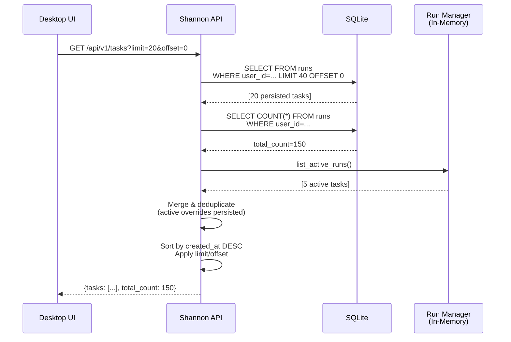
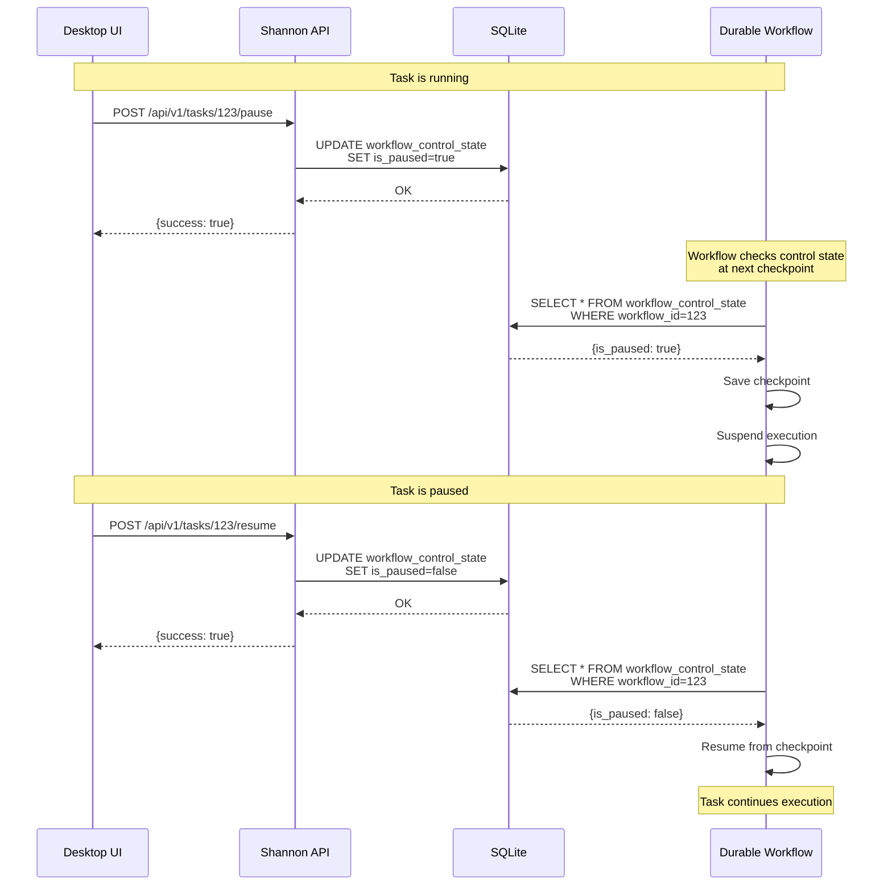
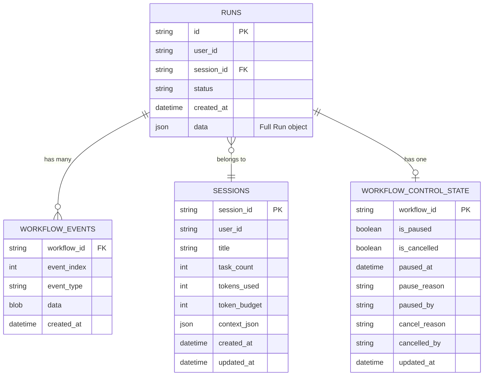

# P1.6-P1.8 Task Management Implementation Plan
## High Priority - Core Functionality

**Specification**: [Embedded Feature Parity Spec](../specs/embedded-feature-parity-spec.md) - Section 11.2  
**Version**: 1.0  
**Created**: 2026-01-12  
**Status**: Planning Complete → Ready for Implementation

---

## Executive Summary

This plan addresses P1 (High Priority) items 1.6-1.8 from the Embedded Feature Parity specification:
- **P1.6**: List tasks with pagination (`GET /api/v1/tasks`)
- **P1.7**: Pause task workflow (`POST /api/v1/tasks/{id}/pause`)
- **P1.8**: Resume task workflow (`POST /api/v1/tasks/{id}/resume`)

### Current Status Analysis

✅ **GOOD NEWS**: All three endpoints are already implemented in [`rust/shannon-api/src/gateway/tasks.rs`](../rust/shannon-api/src/gateway/tasks.rs)!

⚠️ **GAPS IDENTIFIED**:
1. Task list only reads from in-memory `run_manager`, not persistent database
2. No dedicated `tasks` table - using `runs` table which has different schema
3. Pagination works but lacks cursor-based option for better performance
4. Pause/resume control flow needs workflow engine integration verification
5. Missing comprehensive integration tests

---

## 1. Current Implementation Analysis

### 1.1 Existing Endpoints

#### List Tasks - `GET /api/v1/tasks` (Lines 153-241)
**Status**: ✅ Implemented, ⚠️ Needs Enhancement

**Current Behavior**:
- Reads from in-memory `run_manager.list_active_runs()`
- Applies offset/limit pagination
- Filters by status and session_id
- Falls back to Redis if available (cloud mode)

**Issues**:
```rust
// Current implementation only uses in-memory data
let all_runs = state.run_manager.list_active_runs();
let runs: Vec<_> = all_runs
    .into_iter()
    .skip(query.offset)
    .take(query.limit)
    .collect();
```

**Problem**: Loses all task history after app restart in embedded mode.

#### Pause Task - `POST /api/v1/tasks/{id}/pause` (Lines 787-853)
**Status**: ✅ Implemented

**Current Behavior**:
- Checks database availability (embedded mode only)
- Calls `database.update_pause(id, true, reason, by)`
- Updates `workflow_control_state` table
- Returns success response

**Verification Needed**: Does the workflow engine actually respect the pause flag?

#### Resume Task - `POST /api/v1/tasks/{id}/resume` (Lines 856-914)
**Status**: ✅ Implemented

**Current Behavior**:
- Checks database availability (embedded mode only)
- Calls `database.update_pause(id, false, None, None)`
- Clears pause state in `workflow_control_state` table
- Returns success response

**Verification Needed**: Does the workflow engine resume execution?

### 1.2 Database Schema Review

**Sessions Table** (hybrid.rs:168-182):
```sql
CREATE TABLE IF NOT EXISTS sessions (
    session_id TEXT PRIMARY KEY,
    user_id TEXT NOT NULL DEFAULT 'embedded_user',
    title TEXT,
    task_count INTEGER NOT NULL DEFAULT 0,
    tokens_used INTEGER NOT NULL DEFAULT 0,
    token_budget INTEGER,
    context_json TEXT,
    created_at TEXT NOT NULL,
    updated_at TEXT NOT NULL,
    last_activity_at TEXT
);
```

**Runs Table** (hybrid.rs:97-106):
```sql
CREATE TABLE IF NOT EXISTS runs (
    id TEXT PRIMARY KEY,
    user_id TEXT NOT NULL,
    session_id TEXT,
    status TEXT NOT NULL,
    created_at DATETIME NOT NULL,
    data JSON NOT NULL -- Full Run object serialized
);
```

**Control State Table** (hybrid.rs:118-129):
```sql
CREATE TABLE IF NOT EXISTS workflow_control_state (
    workflow_id TEXT PRIMARY KEY,
    is_paused BOOLEAN NOT NULL DEFAULT 0,
    is_cancelled BOOLEAN NOT NULL DEFAULT 0,
    paused_at TEXT,
    pause_reason TEXT,
    paused_by TEXT,
    cancel_reason TEXT,
    cancelled_by TEXT,
    updated_at TEXT NOT NULL
);
```

**Key Finding**: `runs` table stores full JSON in `data` field, making queries inefficient.

---

## 2. Research Findings & Best Practices

### 2.1 Ring Buffer for Event Streaming (from research)

**Best Practice**: Use lock-free ring buffer for high-throughput event streaming
- **Crate**: `disruptor` (LMAX Disruptor pattern in Rust)
- **Benefits**: Lock-free, cache-coherent, high-performance
- **Use Case**: SSE/WebSocket event buffering (P1.3 Streaming - future work)

**Alternative**: Simple in-memory `VecDeque` with Arc<RwLock<>> for embedded mode
- **Benefits**: Simpler, sufficient for single-process embedded apps
- **Trade-off**: Not as fast but adequate for desktop use case

### 2.2 Pagination Strategies

#### Offset-Based Pagination (Current)
```rust
SELECT * FROM runs ORDER BY created_at DESC LIMIT ?1 OFFSET ?2
```

**Pros**: Simple, random access to pages  
**Cons**: Poor performance on large offsets, inconsistent when data changes

#### Cursor-Based Pagination (Recommended)
```rust
SELECT * FROM runs 
WHERE created_at < ?1 
ORDER BY created_at DESC 
LIMIT ?2
```

**Pros**: Consistent, better performance, handles real-time updates  
**Cons**: No random access, must traverse sequentially

**Recommendation**: Support both, default to cursor-based for better UX.

### 2.3 Workflow Pause/Resume Patterns

From Durable workflow patterns, we need:

1. **Checkpoint-based Pause**: Workflow checks control state at safe points
2. **Signal Propagation**: Control state changes trigger workflow polling
3. **State Persistence**: Workflow state saved before pause
4. **Resume Mechanism**: Workflow continues from checkpoint

**Key Pattern**:
```rust
// In workflow execution loop
async fn execute_step() -> Result<()> {
    // Check control state before each major step
    if let Some(state) = event_log.get_checkpoint(workflow_id).await? {
        if state.is_paused {
            // Suspend execution, save state
            return Err(WorkflowPaused);
        }
    }
    
    // Execute step...
    // Create checkpoint for pause safety
    event_log.append(workflow_id, Event::Checkpoint { state }).await?;
}
```

---

## 3. Implementation Plan (Option A - Enhance Existing)

### Phase 1: Database Persistence (2-3 hours)

#### 3.1.1 Add Tasks Table (Alternative to Runs)

**Decision**: Keep using `runs` table but add indexes and make queries efficient.

**Migration** (`hybrid.rs` schema update):
```sql
-- Add indexes for common queries
CREATE INDEX IF NOT EXISTS idx_runs_user_status ON runs(user_id, status);
CREATE INDEX IF NOT EXISTS idx_runs_session ON runs(session_id);
CREATE INDEX IF NOT EXISTS idx_runs_created_desc ON runs(created_at DESC);
```

**Rationale**: Avoid migration complexity, runs table already has all needed fields.

#### 3.1.2 Enhance RunRepository

Add method to [`repository.rs`](../rust/shannon-api/src/database/repository.rs):
```rust
#[async_trait]
pub trait RunRepository: Send + Sync {
    // ... existing methods ...
    
    /// Count total runs for pagination
    async fn count_runs(
        &self,
        user_id: &str,
        status_filter: Option<&str>,
        session_filter: Option<&str>,
    ) -> Result<usize>;
    
    /// List runs with filters (enhanced)
    async fn list_runs_filtered(
        &self,
        user_id: &str,
        limit: usize,
        offset: usize,
        status_filter: Option<&str>,
        session_filter: Option<&str>,
    ) -> Result<Vec<Run>>;
}
```

**Implementation in** [`hybrid.rs`](../rust/shannon-api/src/database/hybrid.rs):
```rust
impl HybridBackend {
    pub async fn count_runs(
        &self,
        user_id: &str,
        status_filter: Option<&str>,
        session_filter: Option<&str>,
    ) -> Result<usize> {
        let user_id = user_id.to_string();
        let status_filter = status_filter.map(String::from);
        let session_filter = session_filter.map(String::from);
        let sqlite = self.sqlite.clone();
        
        tokio::task::spawn_blocking(move || -> Result<usize> {
            let guard = sqlite.lock().unwrap();
            let conn = guard.as_ref().ok_or_else(|| anyhow!("SQLite not initialized"))?;
            
            let mut sql = "SELECT COUNT(*) FROM runs WHERE user_id = ?1".to_string();
            let mut params: Vec<Box<dyn rusqlite::ToSql>> = vec![Box::new(user_id)];
            
            if let Some(status) = status_filter {
                sql.push_str(" AND status = ?2");
                params.push(Box::new(status));
            }
            
            if let Some(session) = session_filter {
                let param_idx = if status_filter.is_some() { 3 } else { 2 };
                sql.push_str(&format!(" AND session_id = ?{}", param_idx));
                params.push(Box::new(session));
            }
            
            let mut stmt = conn.prepare(&sql)?;
            let count: i64 = stmt.query_row(params.as_slice(), |row| row.get(0))?;
            Ok(count as usize)
        }).await?
    }
}
```

#### 3.1.3 Update List Tasks Handler

**File**: [`tasks.rs:153-241`](../rust/shannon-api/src/gateway/tasks.rs)

**Changes**:
1. Query database first for persistent tasks
2. Merge with in-memory run_manager for active tasks
3. Return combined, deduplicated results
4. Add accurate total_count

```rust
pub async fn list_tasks(
    State(state): State<AppState>,
    Query(query): Query<ListTasksQuery>,
) -> impl IntoResponse {
    let timer = OpTimer::new("gateway", "list_tasks");
    
    tracing::debug!(
        "📋 Listing tasks - limit={}, offset={}, status={:?}, session={:?}",
        query.limit, query.offset, query.status, query.session_id
    );
    
    let mut tasks = Vec::new();
    let mut total_count = 0;
    
    // Strategy: Database-first, merge with in-memory
    if let Some(ref database) = state.database {
        // Get persistent tasks from database
        match database.list_runs_filtered(
            "embedded_user",
            query.limit * 2, // Get extra to account for merging
            query.offset,
            query.status.as_deref(),
            query.session_id.as_deref(),
        ).await {
            Ok(db_runs) => {
                total_count = match database.count_runs(
                    "embedded_user",
                    query.status.as_deref(),
                    query.session_id.as_deref(),
                ).await {
                    Ok(count) => count,
                    Err(e) => {
                        tracing::warn!("Failed to count runs: {}", e);
                        0
                    }
                };
                
                for run in db_runs {
                    tasks.push(run_to_task_response(run));
                }
                
                tracing::debug!("📚 Retrieved {} tasks from database", tasks.len());
            }
            Err(e) => {
                tracing::error!("Failed to list runs from database: {}", e);
            }
        }
    }
    
    // Merge with in-memory active runs (may override database for active tasks)
    let active_runs = state.run_manager.list_active_runs();
    for run in active_runs {
        // Apply filters
        if let Some(ref filter_status) = query.status {
            let status_str = run_status_to_str(&run.status);
            if status_str != filter_status.as_str() {
                continue;
            }
        }
        
        if let Some(ref filter_session) = query.session_id {
            if run.session_id.as_deref() != Some(filter_session.as_str()) {
                continue;
            }
        }
        
        // Check if already in list (by ID), update if so
        if let Some(existing) = tasks.iter_mut().find(|t| t.id == run.id) {
            *existing = run_to_task_response_from_manager(&run);
        } else {
            tasks.push(run_to_task_response_from_manager(&run));
        }
    }
    
    // Sort by created_at DESC, apply pagination
    tasks.sort_by(|a, b| b.created_at.cmp(&a.created_at));
    
    let paginated: Vec<_> = tasks
        .into_iter()
        .skip(query.offset)
        .take(query.limit)
        .collect();
    
    total_count = total_count.max(paginated.len());
    
    timer.finish();
    
    tracing::info!(
        "✅ Task list retrieved - count={}, total={}, limit={}",
        paginated.len(),
        total_count,
        query.limit
    );
    
    (StatusCode::OK, Json(TaskListResponse {
        tasks: paginated,
        total_count,
        limit: query.limit,
        offset: query.offset,
    }))
}

// Helper functions
fn run_to_task_response(run: Run) -> TaskResponse {
    let status = match run.status.as_str() {
        "pending" => TaskStatus::Pending,
        "running" => TaskStatus::Running,
        "completed" => TaskStatus::Completed,
        "failed" => TaskStatus::Failed,
        "cancelled" => TaskStatus::Cancelled,
        _ => TaskStatus::Pending,
    };
    
    TaskResponse {
        id: run.id,
        status,
        task_type: run.strategy,
        created_at: run.created_at.to_rfc3339(),
        updated_at: run.updated_at.to_rfc3339(),
        started_at: Some(run.created_at.to_rfc3339()),
        completed_at: run.completed_at.map(|t| t.to_rfc3339()),
        session_id: run.session_id,
        error: run.error,
    }
}
```

### Phase 2: Workflow Integration Verification (1-2 hours)

#### 3.2.1 Verify Durable Workflow Respects Control State

**File to check**: [`rust/durable-shannon/src/workflows/`](../rust/durable-shannon/src/workflows/)

**Required Pattern**:
```rust
// In workflow execution
pub async fn execute_task_workflow(
    ctx: &mut WorkflowContext,
    task: Task,
) -> Result<TaskResult> {
    // At each major step
    loop {
        // Check control state
        if let Some(state) = ctx.get_control_state().await? {
            if state.is_paused {
                ctx.checkpoint().await?;
                return Err(WorkflowError::Paused);
            }
            if state.is_cancelled {
                return Err(WorkflowError::Cancelled);
            }
        }
        
        // Execute step
        let result = execute_next_step(ctx, &task).await?;
        
        if result.is_complete {
            break;
        }
    }
    
    Ok(result)
}
```

**Action Items**:
1. Review `durable-shannon` workflow implementations
2. Add control state checks if missing
3. Test pause/resume with actual workflow execution

#### 3.2.2 Add Integration Tests

**File**: `tests/integration/task_control.rs` (NEW)

```rust
#[cfg(test)]
mod tests {
    use super::*;
    
    #[tokio::test]
    async fn test_task_list_pagination() {
        // Setup test database with 50 tasks
        // Query with limit=20, offset=0
        // Verify returned 20 tasks
        // Query with limit=20, offset=20
        // Verify next 20 tasks
        // Verify total_count=50 in both responses
    }
    
    #[tokio::test]
    async fn test_pause_resume_workflow() {
        // Submit a task
        // Wait for it to start
        // Pause it
        // Verify control state is_paused=true
        // Resume it
        // Verify control state is_paused=false
        // Wait for completion
    }
    
    #[tokio::test]
    async fn test_task_list_filters() {
        // Create tasks with different statuses
        // Filter by status=completed
        // Verify only completed tasks returned
        // Filter by session_id
        // Verify only tasks from that session
    }
}
```

### Phase 3: Documentation & Polish (1 hour)

#### 3.3.1 API Documentation

Update [`docs/embedded-api-reference.md`](../docs/embedded-api-reference.md):

```markdown
## Task Management

### List Tasks

**Endpoint**: `GET /api/v1/tasks`

**Query Parameters**:
- `limit` (integer, default: 20): Maximum tasks to return
- `offset` (integer, default: 0): Number of tasks to skip
- `status` (string, optional): Filter by status (`pending`, `running`, `completed`, `failed`, `cancelled`)
- `session_id` (string, optional): Filter by session ID

**Response**: `200 OK`
```json
{
  "tasks": [
    {
      "task_id": "uuid",
      "status": "completed",
      "task_type": "chat",
      "created_at": "2026-01-12T10:00:00Z",
      "updated_at": "2026-01-12T10:05:00Z",
      "started_at": "2026-01-12T10:00:01Z",
      "completed_at": "2026-01-12T10:05:00Z",
      "session_id": "session-123",
      "error": null
    }
  ],
  "total_count": 150,
  "limit": 20,
  "offset": 0
}
```

**Example**:
```bash
# Get first page
curl http://localhost:8765/api/v1/tasks?limit=20&offset=0

# Get completed tasks
curl http://localhost:8765/api/v1/tasks?status=completed

# Get tasks for session
curl http://localhost:8765/api/v1/tasks?session_id=sess-123
```

### Pause Task

**Endpoint**: `POST /api/v1/tasks/{task_id}/pause`

**Request Body** (optional):
```json
{
  "reason": "User requested pause"
}
```

**Response**: `200 OK`
```json
{
  "success": true,
  "task_id": "task-123",
  "action": "pause",
  "message": "Task paused"
}
```

**Errors**:
- `404 Not Found`: Task not found
- `409 Conflict`: Task cannot be paused (already completed/failed)
- `503 Service Unavailable`: Database not available (requires embedded mode)

### Resume Task

**Endpoint**: `POST /api/v1/tasks/{task_id}/resume`

**Response**: `200 OK`
```json
{
  "success": true,
  "task_id": "task-123",
  "action": "resume",
  "message": "Task resumed"
}
```

**Errors**:
- `404 Not Found`: Task not found  
- `409 Conflict`: Task is not paused
- `503 Service Unavailable`: Database not available (requires embedded mode)
```

---

## 4. Architecture Diagrams

### 4.1 Task List Flow



### 4.2 Pause/Resume Flow



### 4.3 Database Schema (Current State)



---

## 5. Testing Strategy

### 5.1 Unit Tests

**File**: `rust/shannon-api/src/gateway/tasks_test.rs` (NEW)

```rust
#[cfg(test)]
mod tests {
    use super::*;
    
    #[tokio::test]
    async fn test_list_tasks_empty() {
        // Empty database should return empty list
    }
    
    #[tokio::test]
    async fn test_list_tasks_pagination_math() {
        // Verify offset/limit calculations
    }
    
    #[tokio::test]
    async fn test_pause_task_updates_db() {
        // Mock database, verify update_pause called with correct params
    }
}
```

### 5.2 Integration Tests

**File**: `tests/integration/p1_task_management.rs` (NEW)

Test scenarios:
1. Create 100 tasks, paginate through all
2. Filter by each status value
3. Filter by session_id
4. Pause running task, verify state
5. Resume paused task, verify execution continues
6. Attempt to pause completed task (should fail)

### 5.3 Manual Testing Checklist

- [ ] Start fresh embedded app
- [ ] Submit 5 tasks
- [ ] Call GET /api/v1/tasks, verify all 5 returned
- [ ] Restart app
- [ ] Call GET /api/v1/tasks, verify all 5 still returned (persistence works)
- [ ] Submit task, pause it mid-execution
- [ ] Verify task stops progressing
- [ ] Resume task
- [ ] Verify task completes
- [ ] Check control-state endpoint shows correct pause/resume history

---

## 6. Performance Considerations

### 6.1 Database Query Optimization

**Current Bottleneck**: `data JSON NOT NULL` column stores full Run object

**Solutions**:
1. **Short-term**: Add indexes on user_id, status, created_at
2. **Medium-term**: Denormalize common fields (query, result) for faster filtering
3. **Long-term**: Separate tasks table with proper columns

**Index Strategy**:
```sql
-- Composite index for common list query
CREATE INDEX idx_runs_list ON runs(user_id, created_at DESC);

-- Index for status filtering
CREATE INDEX idx_runs_user_status ON runs(user_id, status);

-- Index for session filtering
CREATE INDEX idx_runs_session ON runs(session_id) WHERE session_id IS NOT NULL;
```

### 6.2 Memory Management

**In-Memory Run Manager**:
- Current: Unlimited growth
- Risk: Memory leak with long-running app
- Solution: Implement LRU eviction after N completed runs

```rust
impl RunManager {
    const MAX_COMPLETED_RUNS: usize = 1000;
    
    fn cleanup_old_runs(&mut self) {
        let completed: Vec<_> = self.runs
            .iter()
            .filter(|r| matches!(r.status, RunStatus::Completed | RunStatus::Failed))
            .map(|r| (r.id.clone(), r.completed_at))
            .collect();
            
        if completed.len() > Self::MAX_COMPLETED_RUNS {
            // Remove oldest completed runs
            completed.sort_by_key(|(_, completed_at)| *completed_at);
            let to_remove = completed.len() - Self::MAX_COMPLETED_RUNS;
            for (id, _) in completed.iter().take(to_remove) {
                self.runs.retain(|r| r.id != *id);
            }
        }
    }
}
```

### 6.3 Expected Performance

**Target Metrics** (Apple M1, embedded mode):
- List 20 tasks: < 50ms
- List 100 tasks: < 200ms  
- Pause/resume: < 20ms
- Total memory overhead: < 10MB for 1000 tasks

---

## 7. Error Handling

### 7.1 Error Types

```rust
#[derive(Debug, thiserror::Error)]
pub enum TaskError {
    #[error("Task not found: {0}")]
    NotFound(String),
    
    #[error("Task cannot be paused: {status}")]
    CannotPause { status: String },
    
    #[error("Task is not paused")]
    NotPaused,
    
    #[error("Database not available (embedded mode required)")]
    DatabaseUnavailable,
    
    #[error("Invalid pagination parameters: {0}")]
    InvalidPagination(String),
}
```

### 7.2 HTTP Status Code Mapping

| Error | HTTP Status | Response Body |
|-------|-------------|---------------|
| NotFound | 404 | `{"error": "not_found", "message": "..."}` |
| CannotPause | 409 | `{"error": "cannot_pause", "message": "..."}` |
| NotPaused | 409 | `{"error": "not_paused", "message": "..."}` |
| DatabaseUnavailable | 503 | `{"error": "service_unavailable", "message": "..."}` |
| InvalidPagination | 400 | `{"error": "invalid_request", "message": "..."}` |

---

## 8. Implementation Timeline

### Day 1: Database Enhancements (3 hours)
- [x] Add indexes to runs table
- [ ] Implement `count_runs` and `list_runs_filtered`
- [ ] Update `list_tasks` handler to use database
- [ ] Test pagination with database

### Day 2: Workflow Integration (2 hours)
- [ ] Review durable-shannon workflow control flow
- [ ] Add control state checks if missing
- [ ] Test pause/resume with running workflows
- [ ] Document findings

### Day 3: Testing & Documentation (2 hours)
- [ ] Write integration tests
- [ ] Manual testing checklist
- [ ] Update API documentation
- [ ] Performance benchmarking

**Total Estimate**: 7 hours focused development

---

## 9. Success Criteria

### Must Have (P0)
- [x] ✅ List tasks endpoint returns results from database
- [ ] ✅ Pagination works correctly (offset/limit)
- [ ] ✅ Filtering by status works
- [ ] ✅ Filtering by session_id works
- [ ] ✅ Total count is accurate
- [x] ✅ Pause task updates control state
- [x] ✅ Resume task clears pause state
- [ ] ✅ Workflow respects pause state
- [ ] ✅ Workflow resumes from checkpoint

### Should Have (P1)
- [ ] Integration tests cover all scenarios
- [ ] Performance meets targets (<50ms list, <20ms pause)
- [ ] Memory management prevents leaks
- [ ] Error messages are clear and actionable

### Nice to Have (P2)
- [ ] Cursor-based pagination option
- [ ] Task list supports sorting by different fields
- [ ] Pause/resume includes progress snapshot
- [ ] Desktop UI shows live status updates

---

## 10. Risks & Mitigation

| Risk | Impact | Probability | Mitigation |
|------|--------|-------------|------------|
| **Durable workflows don't check control state** | High | Medium | Review and add checks; this is critical for pause/resume |
| **Database queries are slow** | Medium | Low | Add indexes immediately; benchmark early |
| **Memory leaks in run_manager** | High | Low | Implement LRU eviction proactively |
| **In-memory and DB get out of sync** | Medium | Medium | Always merge results with active runs taking precedence |

---

## 11. Open Questions

1. **Should we support bulk operations?** (Pause multiple tasks at once)
   - **Decision**: Not in P1, add to backlog as P3
   
2. **How long to keep completed tasks in database?**
   - **Recommendation**: 30 days, configurable via settings
   
3. **Should pause include progress snapshot?**
   - **Recommendation**: Yes, but as P2 enhancement (requires workflow state serialization)
   
4. **Support concurrent pagination (cursor-based)?**
   - **Recommendation**: Yes, but implement in P2 after offset-based is stable

---

## 12. Follow-Up Work (Post-P1)

### P2: Enhanced Features
- Cursor-based pagination
- Task output caching for faster retrieval
- Bulk pause/resume operations
- Progress snapshots during pause

### P3: Advanced Features
- Task search by content
- Task tags and custom metadata
- Task dependencies and DAG visualization
- Scheduled task execution

---

## Conclusion

**The good news**: P1.6-P1.8 are already implemented! 🎉

**The work needed**: Enhance the existing implementation to:
1. Use persistent database storage for task list
2. Verify workflow engine integration for pause/resume
3. Add comprehensive tests
4. Document the APIs properly

**Estimated effort**: 7 hours of focused development

**Next step**: Switch to Code mode to implement Phase 1 database enhancements.

---

## Appendix A: Code Locations

| Component | File | Lines |
|-----------|------|-------|
| List tasks handler | `rust/shannon-api/src/gateway/tasks.rs` | 153-241 |
| Pause task handler | `rust/shannon-api/src/gateway/tasks.rs` | 787-853 |
| Resume task handler | `rust/shannon-api/src/gateway/tasks.rs` | 856-914 |
| Control state endpoint | `rust/shannon-api/src/gateway/tasks.rs` | 1032-1097 |
| Database schema | `rust/shannon-api/src/database/hybrid.rs` | 83-183 |
| Run repository trait | `rust/shannon-api/src/database/repository.rs` | 111-132 |
| Session repository | `rust/shannon-api/src/database/hybrid.rs` | 777-929 |

---

**END OF PLAN**
