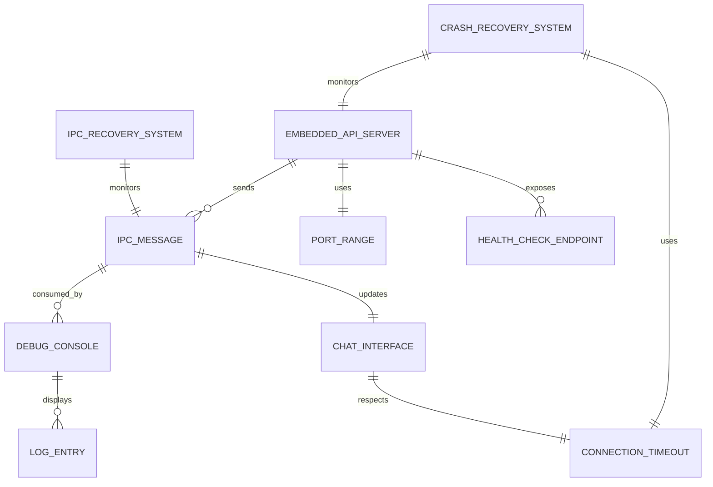

# Data Model: Embedded API Server Startup with IPC Communication

**Feature**: 001-embedded-api-startup
**Date**: 2026-01-09

## Core Entities

### 1. Embedded API Server

**Purpose**: The backend service that handles agent interactions and chat functionality

**State Transitions**:
```
Idle → Starting → Port Discovery → Binding → Initializing → Ready → Running
  ↓         ↓           ↓            ↓           ↓         ↓        ↓
Crashed ← Failed ←   Failed ←     Failed ←   Failed ←  Failed ←  Failed
  ↓
Restarting (with exponential backoff)
```

**Properties**:
- `port: u16` - Currently bound port (1906-1915 range)
- `state: ServerState` - Current operational state
- `start_time: DateTime<Utc>` - Server start timestamp
- `restart_count: u32` - Number of restart attempts
- `base_url: String` - Full HTTP URL (e.g., "http://127.0.0.1:1906")
- `process_id: Option<u32>` - OS process identifier

**Validation Rules**:
- Port must be in range 1906-1915
- Restart count must not exceed 3
- State transitions must follow valid flow
- Base URL must match bound port

### 2. IPC Message

**Purpose**: Communication mechanism between Tauri backend and Next.js frontend

**Types**:
- **Server Ready Message**: Carries successful port number and base URL
- **Log Stream Message**: Carries log events for debug console
- **State Change Message**: Notifies of server state transitions
- **Error Message**: Carries error details and recovery actions

**Properties**:
- `message_type: IpcMessageType` - Type discriminator
- `timestamp: DateTime<Utc>` - Message creation time
- `payload: JsonValue` - Message-specific data
- `correlation_id: Option<String>` - For request-response correlation

**Validation Rules**:
- Timestamp must be present and valid
- Payload must match message type schema
- Message size should not exceed 64KB for performance

### 3. Debug Console

**Purpose**: Frontend component displaying real-time logs and system state for debugging

**Properties**:
- `visible: bool` - Console visibility state
- `log_buffer: Vec<LogEntry>` - Circular buffer of log entries (max 1000)
- `filter_level: LogLevel` - Current log level filter
- `filter_component: Option<Component>` - Component filter
- `search_query: String` - Current search text
- `auto_scroll: bool` - Automatic scroll to latest logs

**Relationships**:
- Consumes IPC Messages of type LogStream
- Displays LogEntry entities
- Filters based on LogLevel and Component

**Business Rules**:
- Buffer size limited to 1000 entries (circular)
- Search results debounced by 300ms
- Auto-scroll disabled when user scrolls manually

### 4. Chat Interface

**Purpose**: Frontend component enabling user interaction with agents

**State Dependencies**:
```
Server State → Chat Interface State
Ready        → Enabled
Starting     → Disabled (with loading indicator)
Failed       → Disabled (with error message)
Restarting   → Disabled (with retry status)
```

**Properties**:
- `enabled: bool` - Whether chat can accept input
- `connection_status: ConnectionStatus` - Health of server connection
- `pending_messages: Vec<Message>` - Queued messages during disconnection
- `last_health_check: DateTime<Utc>` - Last successful health check

**Validation Rules**:
- Cannot send messages when disabled
- Pending messages queue limited to 100 entries
- Health check must be successful within last 30 seconds

### 5. Port Range

**Purpose**: Configuration entity defining allowable port numbers for embedded server

**Properties**:
- `start_port: u16` - Starting port (default: 1906)
- `end_port: u16` - Ending port (default: 1915)
- `preferred_port: u16` - Preferred starting port (default: 1906)
- `discovery_strategy: PortDiscoveryStrategy` - Sequential or Random

**Constraints**:
- `start_port <= end_port`
- Range size >= 1 and <= 100
- All ports must be > 1024 (unprivileged range)
- Preferred port must be within range

### 6. Health Check Endpoint

**Purpose**: Server endpoint confirming readiness to handle chat requests

**Endpoints**:
- `/health` - Liveness probe (basic responsiveness)
- `/ready` - Readiness probe (can handle requests)
- `/startup` - Startup probe (initialization complete)

**Response Properties**:
- `status: HealthStatus` - OK, Degraded, or Error
- `timestamp: DateTime<Utc>` - Check execution time
- `uptime_seconds: u64` - Server uptime
- `dependencies: Vec<DependencyHealth>` - Status of dependent services
- `version: String` - Server version information

**Validation Rules**:
- Response time must be < 5 seconds (with timeout)
- Status must reflect actual dependency states
- Dependencies must be checked within last 30 seconds

### 7. Crash Recovery System

**Purpose**: Monitors embedded server health and handles automatic restart

**Properties**:
- `max_attempts: u32` - Maximum restart attempts (default: 3)
- `current_attempt: u32` - Current restart attempt number
- `backoff_sequence: Vec<Duration>` - Exponential backoff delays [1s, 2s, 4s]
- `last_restart_time: DateTime<Utc>` - Timestamp of last restart attempt
- `recovery_state: RecoveryState` - Current recovery process state

**State Machine**:
```
Monitoring → Failure Detected → Restarting → Success → Monitoring
     ↓              ↓              ↓           ↑
   Healthy      Max Attempts    Backoff     Recovery
                 Exceeded        Delay
                    ↓
               Permanent Failure
```

**Business Rules**:
- Exponential backoff: attempt_delay = 2^(attempt-1) seconds
- Permanent failure after 3 consecutive failures
- Reset attempt counter after 24 hours of stable operation

### 8. Connection Timeout

**Purpose**: Configuration for connection timeout and retry behavior

**Properties**:
- `timeout_seconds: u64` - Connection timeout (default: 5)
- `retry_attempts: u32` - Connection retry attempts before failure
- `retry_delay: Duration` - Delay between connection retries

**Validation Rules**:
- Timeout between 1 and 30 seconds
- Retry attempts between 0 and 10
- Total retry time should not exceed 60 seconds

### 9. IPC Recovery System

**Purpose**: Monitors IPC communication health and handles recovery

**Properties**:
- `heartbeat_interval: Duration` - IPC health check frequency
- `missed_heartbeats: u32` - Counter of consecutive missed heartbeats
- `max_missed_heartbeats: u32` - Threshold for triggering recovery (default: 3)
- `recovery_strategy: IpcRecoveryStrategy` - Recovery approach when IPC fails

**Recovery Strategies**:
- `RestartIpc` - Attempt to restart IPC communication
- `RestartServer` - Full server restart
- `GracefulShutdown` - Controlled application shutdown

## Entity Relationships



## Data Persistence

### In-Memory Only
- Server state and status
- IPC message buffers
- Debug console log buffer
- Health check results
- Recovery system state

### Configuration Files
- Port range preferences
- Timeout configurations
- Recovery system settings
- Debug console preferences

### No Database Persistence Required
This feature operates entirely in-memory with configuration-based settings. No persistent data storage needed.