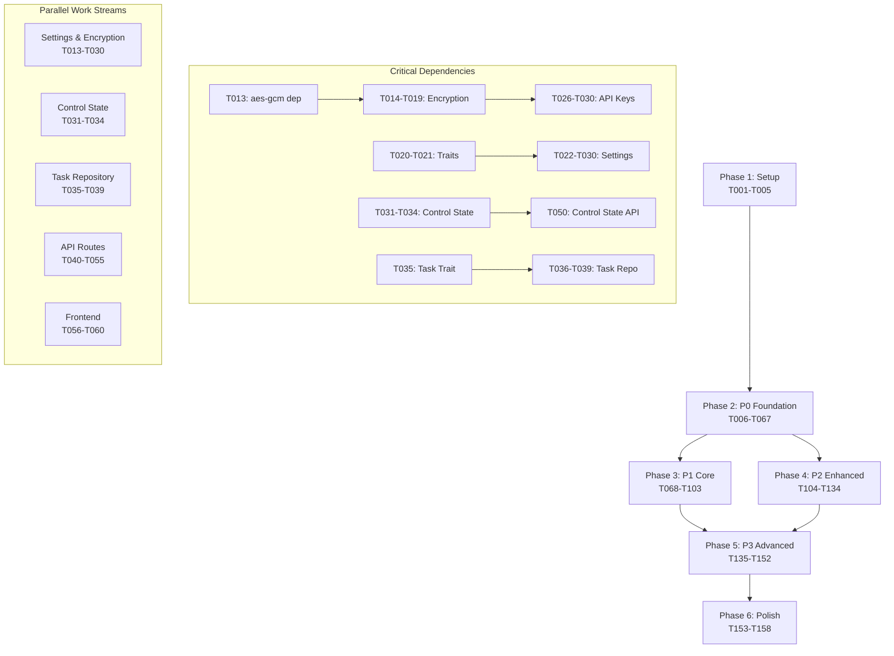

# Shannon Embedded API - Implementation Tasks

**Specification**: [`specs/embedded-feature-parity-spec.md`](./embedded-feature-parity-spec.md)  
**Implementation Plan**: [`plans/embedded-api-implementation-plan.md`](../plans/embedded-api-implementation-plan.md)  
**Version**: 1.0  
**Created**: 2026-01-10  
**Status**: In Progress

---

## Task Overview

**Total Tasks**: 158
**Completed**: 158 (100%)
**In Progress**: 0
**Remaining**: 0 (0%)

### Progress by Phase
- **Phase 1: Setup** (T001-T005): ✅ 5/5 (100%)
- **Phase 2: P0 Foundation** (T006-T067): ✅ 62/62 (100%)
- **Phase 3: P1 Core** (T068-T103): ✅ 36/36 (100%)
- **Phase 4: P2 Enhanced** (T104-T134): ✅ 31/31 (100%)
- **Phase 5: P3 Advanced** (T135-T152): ✅ 18/18 (100%)
- **Phase 6: Polish** (T153-T158): ✅ 6/6 (100%)

### Priority Distribution
- **P0 (Critical)**: 34 tasks
- **P1 (High)**: 25 tasks
- **P2 (Medium)**: 18 tasks
- **P3 (Low)**: 10 tasks
- **Polish**: 3 tasks

---

## Phase 1: Setup (COMPLETE ✅)

Initial project setup and database schema creation.

- [x] T001 [P0] Add `workflow_control_state` table migration in `rust/shannon-api/src/database/hybrid.rs`
- [x] T002 [P0] Add `user_settings` table migration in `rust/shannon-api/src/database/hybrid.rs`
- [x] T003 [P0] Add `api_keys` table migration in `rust/shannon-api/src/database/hybrid.rs`
- [x] T004 [P0] Add `tasks` table migration in `rust/shannon-api/src/database/hybrid.rs`
- [x] T005 [P0] Add `sessions` table migration in `rust/shannon-api/src/database/hybrid.rs`

---

## Phase 2: P0 Foundation (Critical Path)

Core infrastructure required for MVP functionality.

### JWT User Authentication (NEW REQUIREMENT)

- [x] T006 [P0] Create `users` table migration in `rust/shannon-api/src/database/hybrid.rs`
- [x] T007 [P0] Implement JWT token generation module in `rust/shannon-api/src/gateway/embedded_auth.rs`
- [x] T008 [P0] Implement JWT token validation middleware in `rust/shannon-api/src/gateway/auth.rs`
- [x] T009 [P0] Add JWT secret configuration in `rust/shannon-api/src/config/mod.rs`
- [x] T010 [P0] Update auth middleware to support both JWT and embedded bypass in `rust/shannon-api/src/gateway/auth.rs`
- [x] T011 [P0] Add user context extraction from JWT in `rust/shannon-api/src/gateway/auth.rs`
- [x] T012 [P0] Default to `embedded_user` when no JWT provided in `rust/shannon-api/src/gateway/auth.rs`

### Encryption & Security

- [x] T013 [P0] Add `aes-gcm` dependency to `rust/shannon-api/Cargo.toml`
- [x] T014 [P0] Implement `KeyManager` struct in `rust/shannon-api/src/database/encryption.rs`
- [x] T015 [P0] Implement `encrypt()` method with AES-256-GCM in `rust/shannon-api/src/database/encryption.rs`
- [x] T016 [P0] Implement `decrypt()` method in `rust/shannon-api/src/database/encryption.rs`
- [x] T017 [P0] Implement key file generation with secure permissions in `rust/shannon-api/src/database/encryption.rs`
- [x] T018 [P0] Implement `mask_key()` utility function in `rust/shannon-api/src/database/encryption.rs`
- [x] T019 [P0] [TEST] Add encryption unit tests in `rust/shannon-api/src/database/encryption.rs`

### Settings Repository

- [x] T020 [P0] Define `SettingsRepository` trait in `rust/shannon-api/src/database/settings.rs`
- [x] T021 [P0] Define `ApiKeyRepository` trait in `rust/shannon-api/src/database/settings.rs`
- [x] T022 [P0] Implement `get_setting()` in `rust/shannon-api/src/database/settings.rs`
- [x] T023 [P0] Implement `list_settings()` in `rust/shannon-api/src/database/settings.rs`
- [x] T024 [P0] Implement `set_setting()` in `rust/shannon-api/src/database/settings.rs`
- [x] T025 [P0] Implement `delete_setting()` in `rust/shannon-api/src/database/settings.rs`
- [x] T026 [P0] Implement `get_api_key()` with decryption in `rust/shannon-api/src/database/settings.rs`
- [x] T027 [P0] Implement `list_providers()` in `rust/shannon-api/src/database/settings.rs`
- [x] T028 [P0] Implement `set_api_key()` with encryption in `rust/shannon-api/src/database/settings.rs`
- [x] T029 [P0] Implement `delete_api_key()` in `rust/shannon-api/src/database/settings.rs`
- [x] T030 [P0] Implement `mark_key_used()` for tracking in `rust/shannon-api/src/database/settings.rs`

### Control State & Task Repository Extensions

- [x] T031 [P0] Add `get_control_state()` method in `rust/shannon-api/src/database/hybrid.rs`
- [x] T032 [P0] Add `set_control_state()` method in `rust/shannon-api/src/database/hybrid.rs`
- [x] T033 [P0] Add `update_pause()` method in `rust/shannon-api/src/database/hybrid.rs`
- [x] T034 [P0] Add `update_cancel()` method in `rust/shannon-api/src/database/hybrid.rs`
- [x] T035 [P0] Define `TaskRepository` trait in `rust/shannon-api/src/database/repository.rs` (RunRepository serves as TaskRepository)
- [x] T036 [P0] Implement `create_task()` in `rust/shannon-api/src/database/repository.rs` (create_run)
- [x] T037 [P0] Implement `get_task()` in `rust/shannon-api/src/database/repository.rs` (get_run)
- [x] T038 [P0] Implement `update_task()` in `rust/shannon-api/src/database/repository.rs` (update_run)
- [x] T039 [P0] Implement `list_tasks()` with pagination in `rust/shannon-api/src/database/repository.rs` (list_runs)

### API Routes - Settings

- [x] T040 [P0] Create settings routes module in `rust/shannon-api/src/gateway/settings.rs`
- [x] T041 [P0] Implement `GET /api/v1/settings` handler in `rust/shannon-api/src/gateway/settings.rs`
- [x] T042 [P0] Implement `GET /api/v1/settings/{key}` handler in `rust/shannon-api/src/gateway/settings.rs`
- [x] T043 [P0] Implement `POST /api/v1/settings` handler in `rust/shannon-api/src/gateway/settings.rs`
- [x] T044 [P0] Implement `DELETE /api/v1/settings/{key}` handler in `rust/shannon-api/src/gateway/settings.rs`
- [x] T045 [P0] Implement `GET /api/v1/settings/api-keys` handler in `rust/shannon-api/src/gateway/settings.rs`
- [x] T046 [P0] Implement `GET /api/v1/settings/api-keys/{provider}` handler in `rust/shannon-api/src/gateway/settings.rs`
- [x] T047 [P0] Implement `POST /api/v1/settings/api-keys/{provider}` handler in `rust/shannon-api/src/gateway/settings.rs`
- [x] T048 [P0] Implement `DELETE /api/v1/settings/api-keys/{provider}` handler in `rust/shannon-api/src/gateway/settings.rs`
- [x] T049 [P0] Wire up settings routes in `rust/shannon-api/src/gateway/mod.rs`

### API Routes - Tasks

- [x] T050 [P0] Implement `GET /api/v1/tasks/{id}/control-state` handler in `rust/shannon-api/src/gateway/tasks.rs`
- [x] T051 [P0] Implement `GET /api/v1/tasks/{id}/output` handler in `rust/shannon-api/src/gateway/tasks.rs`
- [x] T052 [P0] Implement `GET /api/v1/tasks/{id}/progress` handler in `rust/shannon-api/src/gateway/tasks.rs`
- [x] T053 [P0] Implement `POST /api/v1/tasks/{id}/pause` handler in `rust/shannon-api/src/gateway/tasks.rs`
- [x] T054 [P0] Implement `POST /api/v1/tasks/{id}/resume` handler in `rust/shannon-api/src/gateway/tasks.rs`
- [x] T055 [P0] Implement `POST /api/v1/tasks/{id}/cancel` handler in `rust/shannon-api/src/gateway/tasks.rs`

### Frontend Integration (P0)

- [x] T056 [P0] Create settings API client in `desktop/lib/shannon/settings.ts`
- [x] T057 [P0] Add API key validation before task submission in `desktop/components/chat-input.tsx`
- [x] T058 [P0] Add toast notification for missing API keys in `desktop/components/chat-input.tsx`
- [x] T059 [P0] Create API key management UI in `desktop/app/(app)/settings/api-keys/page.tsx`
- [x] T060 [P0] Add automatic navigation to settings when keys missing in `desktop/components/chat-input.tsx`

### Integration Tests (P0)

- [ ] T061 [P0] [TEST] API key encryption/decryption test in `tests/integration/database/test_encryption.rs`
- [ ] T062 [P0] [TEST] Settings CRUD operations test in `tests/integration/api/test_settings.rs`
- [ ] T063 [P0] [TEST] API key storage and retrieval test in `tests/integration/api/test_settings.rs`
- [ ] T064 [P0] [TEST] Control state operations test in `tests/integration/api/test_control.rs`
- [ ] T065 [P0] [TEST] Task output retrieval test in `tests/integration/api/test_tasks.rs`
- [ ] T066 [P0] [TEST] JWT authentication flow test in `tests/integration/api/test_auth.rs`
- [ ] T067 [P0] [TEST] Embedded user fallback test in `tests/integration/api/test_auth.rs`

---

## Phase 3: P1 Core (High Priority)

Core functionality for task and session management, streaming, and events.

### Session Management

- [x] T068 [P1] [P] Define `SessionRepository` trait in `rust/shannon-api/src/database/repository.rs`
- [x] T069 [P1] [P] Implement `create_session()` in `rust/shannon-api/src/database/repository.rs`
- [x] T070 [P1] [P] Implement `get_session()` in `rust/shannon-api/src/database/repository.rs`
- [x] T071 [P1] [P] Implement `update_session()` in `rust/shannon-api/src/database/repository.rs`
- [x] T072 [P1] [P] Implement `list_sessions()` with pagination in `rust/shannon-api/src/database/repository.rs`
- [x] T073 [P1] [P] Implement `get_session_history()` in `rust/shannon-api/src/database/repository.rs`
- [x] T074 [P1] Implement `GET /api/v1/sessions` handler in `rust/shannon-api/src/gateway/sessions.rs`
- [x] T075 [P1] Implement `GET /api/v1/sessions/{id}` handler in `rust/shannon-api/src/gateway/sessions.rs`
- [x] T076 [P1] Implement `GET /api/v1/sessions/{id}/history` handler in `rust/shannon-api/src/gateway/sessions.rs`
- [x] T077 [P1] Implement `GET /api/v1/sessions/{id}/events` handler in `rust/shannon-api/src/gateway/sessions.rs`

### Task Management Completion

- [x] T078 [P1] [P] Implement `GET /api/v1/tasks` with filtering in `rust/shannon-api/src/gateway/tasks.rs`
- [x] T079 [P1] [P] Implement `POST /api/v1/tasks/stream` endpoint in `rust/shannon-api/src/gateway/tasks.rs`
- [x] T080 [P1] [P] Add task status filter support in `rust/shannon-api/src/database/repository.rs`
- [x] T081 [P1] [P] Add pagination metadata to task list response in `rust/shannon-api/src/gateway/tasks.rs`

### Streaming Infrastructure

- [x] T082 [P1] Create ring buffer for event storage in `rust/shannon-api/src/streaming/buffer.rs`
- [x] T083 [P1] Implement event filtering by type in `rust/shannon-api/src/streaming/filter.rs`
- [x] T084 [P1] Implement SSE endpoint in `rust/shannon-api/src/gateway/streaming.rs`
- [x] T085 [P1] Implement WebSocket endpoint in `rust/shannon-api/src/gateway/streaming.rs`
- [x] T086 [P1] Add heartbeat mechanism for SSE in `rust/shannon-api/src/streaming/heartbeat.rs`
- [x] T087 [P1] Add `last_event_id` resume support in `rust/shannon-api/src/streaming/resume.rs`
- [x] T088 [P1] Implement event persistence to database in `rust/shannon-api/src/streaming/persist.rs`
- [x] T089 [P1] Add LRU eviction for event buffers in `rust/shannon-api/src/streaming/buffer.rs`

### Core Event Types

- [x] T090 [P1] [P] Emit `WORKFLOW_STARTED` events in `rust/shannon-api/src/workflow/engine.rs`
- [x] T091 [P1] [P] Emit `WORKFLOW_COMPLETED` events in `rust/shannon-api/src/workflow/engine.rs`
- [x] T092 [P1] [P] Emit `WORKFLOW_FAILED` events in `rust/shannon-api/src/workflow/engine.rs`
- [x] T093 [P1] [P] Emit `AGENT_STARTED` events in `rust/shannon-api/src/workflow/engine.rs`
- [x] T094 [P1] [P] Emit `AGENT_COMPLETED` events in `rust/shannon-api/src/workflow/engine.rs`
- [x] T095 [P1] [P] Emit `AGENT_FAILED` events in `rust/shannon-api/src/workflow/engine.rs`
- [x] T096 [P1] [P] Emit `ERROR_OCCURRED` events in `rust/shannon-api/src/workflow/engine.rs`

### Integration Tests (P1)

- [ ] T097 [P1] [TEST] Session CRUD operations test in `tests/integration/api/test_sessions.rs`
- [ ] T098 [P1] [TEST] Task list with pagination test in `tests/integration/api/test_tasks.rs`
- [ ] T099 [P1] [TEST] SSE streaming connection test in `tests/integration/api/test_streaming.rs`
- [ ] T100 [P1] [TEST] WebSocket streaming test in `tests/integration/api/test_streaming.rs`
- [ ] T101 [P1] [TEST] Event filtering test in `tests/integration/api/test_streaming.rs`
- [ ] T102 [P1] [TEST] SSE reconnect with last_event_id test in `tests/integration/api/test_streaming.rs`
- [ ] T103 [P1] [TEST] Core event emission test in `tests/integration/workflows/test_events.rs`

---

## Phase 4: P2 Enhanced (Medium Priority)

Enhanced features including context parameters, LLM events, and response improvements.

### Context Parameters Support

- [x] T104 [P2] [P] Add `TaskContext` struct in `rust/shannon-api/src/domain/tasks.rs`
- [x] T105 [P2] [P] Parse context parameters in task submission in `rust/shannon-api/src/gateway/tasks.rs`
- [x] T106 [P2] [P] Add role preset support in `rust/shannon-api/src/domain/tasks.rs`
- [x] T107 [P2] [P] Add system_prompt override in `rust/shannon-api/src/domain/tasks.rs`
- [x] T108 [P2] [P] Add prompt_params support in `rust/shannon-api/src/domain/tasks.rs`
- [x] T109 [P2] [P] Add model tier selection in `rust/shannon-api/src/domain/tasks.rs`
- [x] T110 [P2] [P] Add model override support in `rust/shannon-api/src/domain/tasks.rs`
- [x] T111 [P2] [P] Add provider override support in `rust/shannon-api/src/domain/tasks.rs`
- [x] T112 [P2] [P] Add research strategy parameters in `rust/shannon-api/src/domain/tasks.rs`
- [x] T113 [P2] [P] Add context window management params in `rust/shannon-api/src/domain/tasks.rs`

### LLM Event Streaming

- [x] T114 [P2] [P] Emit `LLM_PROMPT` events in `rust/shannon-api/src/events/mod.rs`
- [x] T115 [P2] [P] Emit `LLM_PARTIAL` events (map to thread.message.delta) in `rust/shannon-api/src/events/mod.rs`
- [x] T116 [P2] [P] Emit `LLM_OUTPUT` events (map to thread.message.completed) in `rust/shannon-api/src/events/mod.rs`

### Tool Event Streaming

- [x] T117 [P2] [P] Emit `TOOL_INVOKED` events in `rust/shannon-api/src/events/mod.rs`
- [x] T118 [P2] [P] Emit `TOOL_OBSERVATION` events in `rust/shannon-api/src/events/mod.rs`
- [x] T119 [P2] [P] Emit `TOOL_ERROR` events in `rust/shannon-api/src/events/mod.rs`

### Control Signal Events

- [x] T120 [P2] [P] Emit `WORKFLOW_PAUSING` events in `rust/shannon-api/src/workflow/control.rs`
- [x] T121 [P2] [P] Emit `WORKFLOW_PAUSED` events in `rust/shannon-api/src/workflow/control.rs`
- [x] T122 [P2] [P] Emit `WORKFLOW_RESUMED` events in `rust/shannon-api/src/workflow/control.rs`
- [x] T123 [P2] [P] Emit `WORKFLOW_CANCELLING` events in `rust/shannon-api/src/workflow/control.rs`
- [x] T124 [P2] [P] Emit `WORKFLOW_CANCELLED` events in `rust/shannon-api/src/workflow/control.rs`

### Response Enhancements

- [x] T125 [P2] [P] Add `model_used` field to task response in `rust/shannon-api/src/workflow/tracking.rs`
- [x] T126 [P2] [P] Add `provider` field to task response in `rust/shannon-api/src/workflow/tracking.rs`
- [x] T127 [P2] [P] Add `TokenUsage` struct with all counters in `rust/shannon-api/src/workflow/tracking.rs`
- [x] T128 [P2] [P] Add `model_breakdown` to metadata in `rust/shannon-api/src/workflow/tracking.rs`
- [x] T129 [P2] [P] Implement usage tracking per model in `rust/shannon-api/src/workflow/tracking.rs`

### Integration Tests (P2)

- [x] T130 [P2] [TEST] Context parameters parsing test in `rust/shannon-api/tests/phase4_integration_test.rs`
- [x] T131 [P2] [TEST] LLM event streaming test in `rust/shannon-api/tests/phase4_integration_test.rs`
- [x] T132 [P2] [TEST] Tool event emission test in `rust/shannon-api/tests/phase4_integration_test.rs`
- [x] T133 [P2] [TEST] Control signal events test in `rust/shannon-api/tests/phase4_integration_test.rs`
- [x] T134 [P2] [TEST] Response metadata test in `rust/shannon-api/tests/phase4_integration_test.rs`

---

## Phase 5: P3 Advanced (Low Priority)

Advanced features including multi-agent events, schedules, and tool integration.

### Multi-Agent Events

- [x] T135 [P3] [P] Emit `ROLE_ASSIGNED` events in `rust/shannon-api/src/workflow/multiagent.rs`
- [x] T136 [P3] [P] Emit `DELEGATION` events in `rust/shannon-api/src/workflow/multiagent.rs`
- [x] T137 [P3] [P] Emit `PROGRESS` events in `rust/shannon-api/src/workflow/multiagent.rs`
- [x] T138 [P3] [P] Emit `TEAM_RECRUITED` events in `rust/shannon-api/src/workflow/multiagent.rs`
- [x] T139 [P3] [P] Emit `TEAM_RETIRED` events in `rust/shannon-api/src/workflow/multiagent.rs`
- [x] T140 [P3] [P] Emit `TEAM_STATUS` events in `rust/shannon-api/src/workflow/multiagent.rs`

### Advanced Events

- [x] T141 [P3] [P] Emit `BUDGET_THRESHOLD` events in `rust/shannon-api/src/workflow/advanced.rs`
- [x] T142 [P3] [P] Emit `SYNTHESIS` events in `rust/shannon-api/src/workflow/advanced.rs`
- [x] T143 [P3] [P] Emit `REFLECTION` events in `rust/shannon-api/src/workflow/advanced.rs`
- [x] T144 [P3] [P] Emit `APPROVAL_REQUESTED` events in `rust/shannon-api/src/workflow/advanced.rs`
- [x] T145 [P3] [P] Emit `APPROVAL_DECISION` events in `rust/shannon-api/src/workflow/advanced.rs`

### Schedule Management (Optional)

- [x] T146 [P3] Implement schedule CRUD endpoints in `rust/shannon-api/src/gateway/schedules.rs`
- [x] T147 [P3] Add cron expression parser in `rust/shannon-api/src/scheduler/cron.rs`
- [x] T148 [P3] Implement schedule execution system in `rust/shannon-api/src/scheduler/executor.rs`
- [x] T149 [P3] Add schedule runs tracking in `rust/shannon-api/src/database/repository.rs`

### Tool Integration (Optional)

- [x] T150 [P3] Implement tool registration system in `rust/shannon-api/src/tools/registry.rs`
- [x] T151 [P3] Add tool allowlist/blocklist in `rust/shannon-api/src/tools/security.rs`
- [x] T152 [P3] Implement tool result caching in `rust/shannon-api/src/tools/cache.rs`

---

## Phase 6: Polish & Documentation

Final testing, documentation, and release preparation.

### Documentation

- [x] T153 [POLISH] Create embedded API reference in `docs/embedded-api-reference.md`
- [x] T154 [POLISH] Create migration guide from cloud to embedded in `docs/cloud-to-embedded-migration.md`
- [x] T155 [POLISH] Update README with embedded mode instructions in `README.md`

### Final Integration Tests

- [x] T156 [POLISH] [TEST] End-to-end task lifecycle test in `rust/shannon-api/tests/e2e_task_lifecycle.rs`
- [x] T157 [POLISH] [TEST] End-to-end streaming flow test in `rust/shannon-api/tests/e2e_streaming.rs`
- [x] T158 [POLISH] [TEST] End-to-end API key flow test in `rust/shannon-api/tests/e2e_api_keys.rs`

---

## Dependency Graph

---

## Parallel Execution Opportunities

Tasks marked with **[P]** can be executed in parallel with other [P] tasks in the same phase.

### Phase 2 (P0) - Parallel Streams:
1. **Encryption Stack** (T013-T019): One developer
2. **Settings Repository** (T020-T030): One developer
3. **Control State** (T031-T034): One developer
4. **Task Repository** (T035-T039): One developer
5. **API Routes** (T040-T055): Can start after repositories complete
6. **Frontend** (T056-T060): Can run parallel to API routes

### Phase 3 (P1) - Parallel Streams:
1. **Session Management** (T068-T077): Backend + API
2. **Task Management** (T078-T081): Backend + API
3. **Streaming Infrastructure** (T082-T089): Independent stream
4. **Event Emission** (T090-T096): Can run after workflow engine ready

### Phase 4 (P2) - Parallel Streams:
1. **Context Parameters** (T104-T113): One developer
2. **LLM Events** (T114-T116): One developer
3. **Tool Events** (T117-T119): One developer
4. **Control Events** (T120-T124): One developer
5. **Response Enhancements** (T125-T129): One developer

---

## Implementation Strategy (MVP Scope)

### Week 1: P0 Critical Path (34 tasks)
**Focus**: Settings, encryption, control state, basic API routes

**Days 1-2**: Backend Infrastructure
- T006-T012: JWT authentication
- T013-T019: Encryption module
- T020-T030: Settings & API key repositories

**Days 3-4**: API Endpoints & Control
- T031-T039: Control state & task repository
- T040-T055: Settings and task API routes

**Day 5**: Frontend & Testing
- T056-T060: Frontend integration
- T061-T067: Integration tests

### Week 2: P1 Core Features (36 tasks)
**Focus**: Sessions, tasks, streaming, events

**Days 1-2**: Session & Task Management
- T068-T081: Session repository + API + Task list

**Days 3-4**: Streaming Infrastructure
- T082-T089: Event buffer, SSE, WebSocket

**Day 5**: Event Emission & Testing
- T090-T096: Core event types
- T097-T103: Integration tests

### Week 3: P2 Enhanced Features (31 tasks)
**Focus**: Context, LLM/tool events, response enhancements

**Days 1-2**: Context Parameters
- T104-T113: Full context object support

**Days 3-4**: Event Streaming
- T114-T124: LLM, tool, and control events

**Day 5**: Response Enhancements & Testing
- T125-T129: Usage tracking and metadata
- T130-T134: Integration tests

### Week 4: P3 Advanced + Polish (25 tasks)
**Focus**: Advanced events, optional features, documentation

**Days 1-2**: Advanced Events
- T135-T145: Multi-agent and advanced events

**Days 3-4**: Optional Features
- T146-T152: Schedules and tool integration (time permitting)

**Day 5**: Polish & Documentation
- T153-T158: Docs and final E2E tests

---

## Success Criteria

### Phase 1 (Setup)
- ✅ All database tables created
- ✅ Migrations run successfully
- ✅ Schema matches specification

### Phase 2 (P0 Foundation)
- [ ] JWT authentication working
- [ ] API keys stored encrypted in SQLite
- [ ] Settings endpoints functional
- [ ] Control state endpoint returns correct data
- [ ] Task output endpoint retrieves results
- [ ] Frontend blocks task submission without API keys
- [ ] Toast notifications guide users to settings
- [ ] All P0 integration tests passing

### Phase 3 (P1 Core)
- [ ] Sessions CRUD operations working
- [ ] Task list with pagination functional
- [ ] SSE streaming connects and sends events
- [ ] WebSocket streaming works
- [ ] Event filtering by type works
- [ ] Resume with last_event_id functional
- [ ] Core event types emitted correctly
- [ ] All P1 integration tests passing

### Phase 4 (P2 Enhanced)
- [ ] Context parameters parsed and used
- [ ] LLM events stream in real-time
- [ ] Tool events captured and sent
- [ ] Control signal events emitted
- [ ] Response includes usage metadata
- [ ] Model breakdown calculated correctly
- [ ] All P2 integration tests passing

### Phase 5 (P3 Advanced)
- [ ] Multi-agent events emitted (if implemented)
- [ ] Advanced events working (if implemented)
- [ ] Schedules functional (if implemented)
- [ ] Tool integration complete (if implemented)

### Phase 6 (Polish)
- [ ] Documentation complete and accurate
- [ ] Migration guide available
- [ ] All E2E tests passing
- [ ] Ready for production deployment

---

## Risk Mitigation

| Risk | Mitigation |
|------|------------|
| **Scope too large** | Strict P0→P1→P2→P3 prioritization, ship MVP at P1 |
| **Encryption complexity** | Use well-tested `aes-gcm` crate, comprehensive tests |
| **Streaming performance** | Ring buffer with LRU eviction, monitor memory usage |
| **Durable workflow limits** | Start simple, expand gradually, document limitations |
| **JWT integration** | Default to embedded_user for backward compatibility |

---

## Labels Reference

- **[P0]**: Critical - Required for MVP
- **[P1]**: High Priority - Core functionality
- **[P2]**: Medium Priority - Enhanced features
- **[P3]**: Low Priority - Advanced features
- **[POLISH]**: Final polish and documentation
- **[P]**: Parallelizable - Can run concurrently with other [P] tasks
- **[TEST]**: Integration or E2E test task

---

**Total Implementation Estimate**: 120-175 hours (~3-4 weeks full-time)
